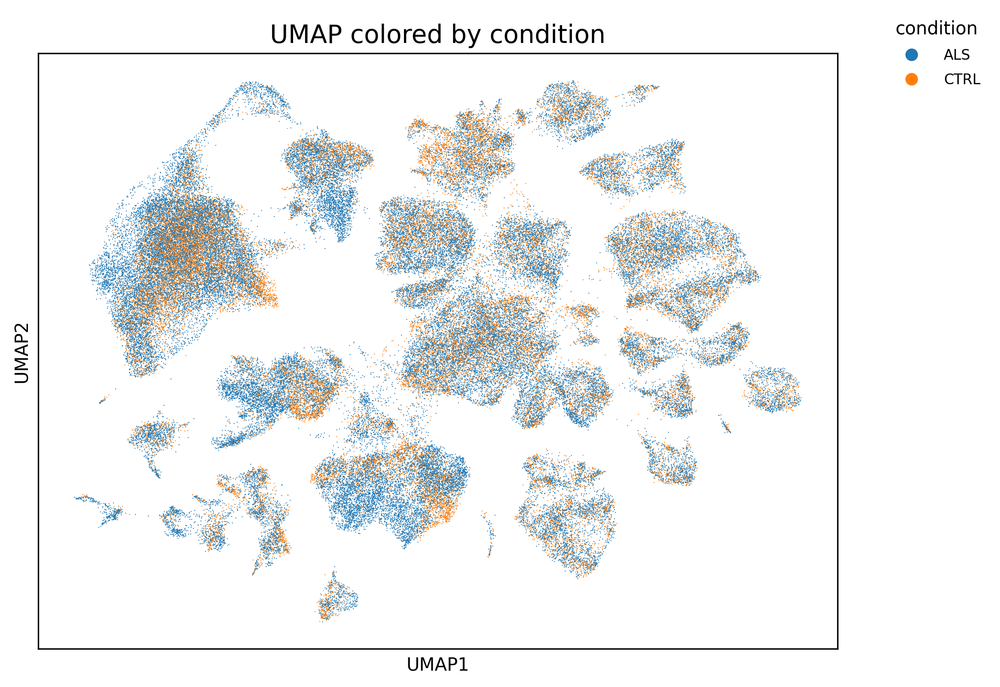
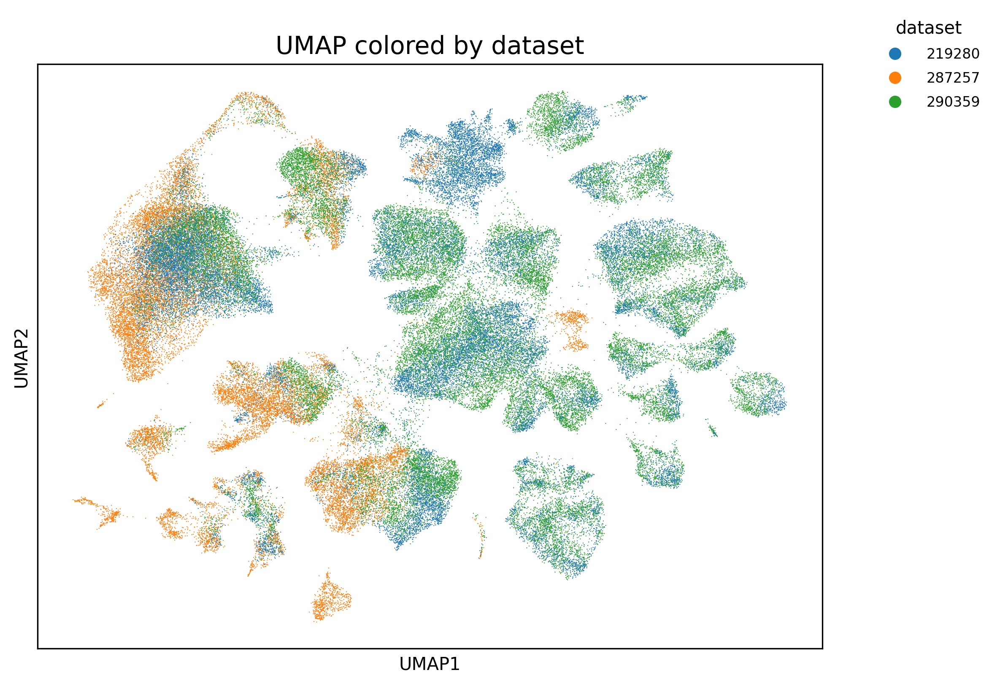
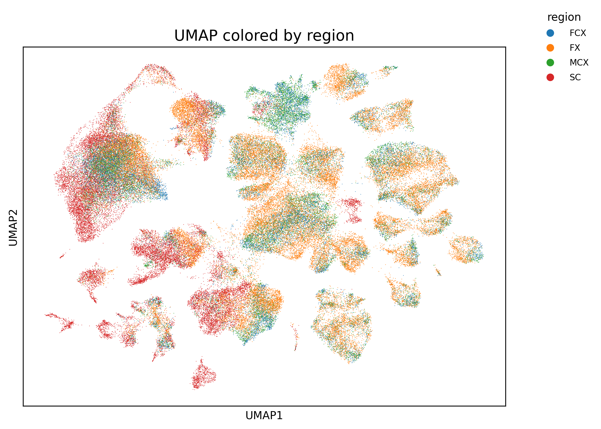
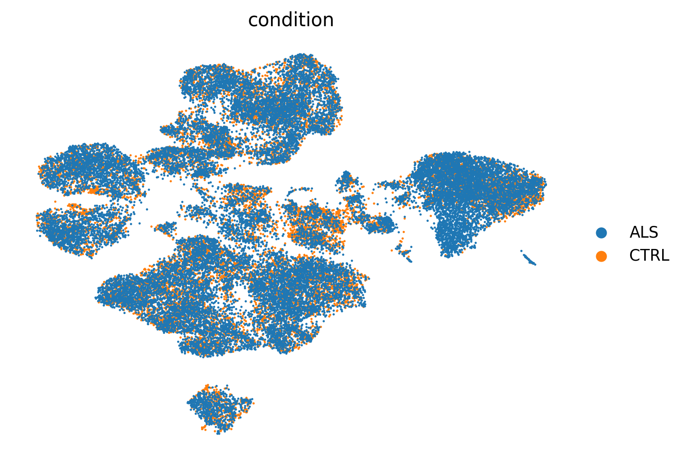
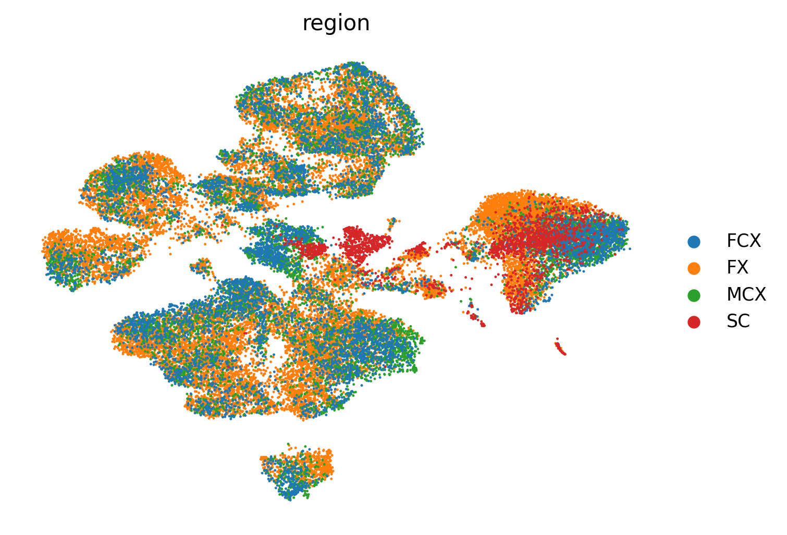
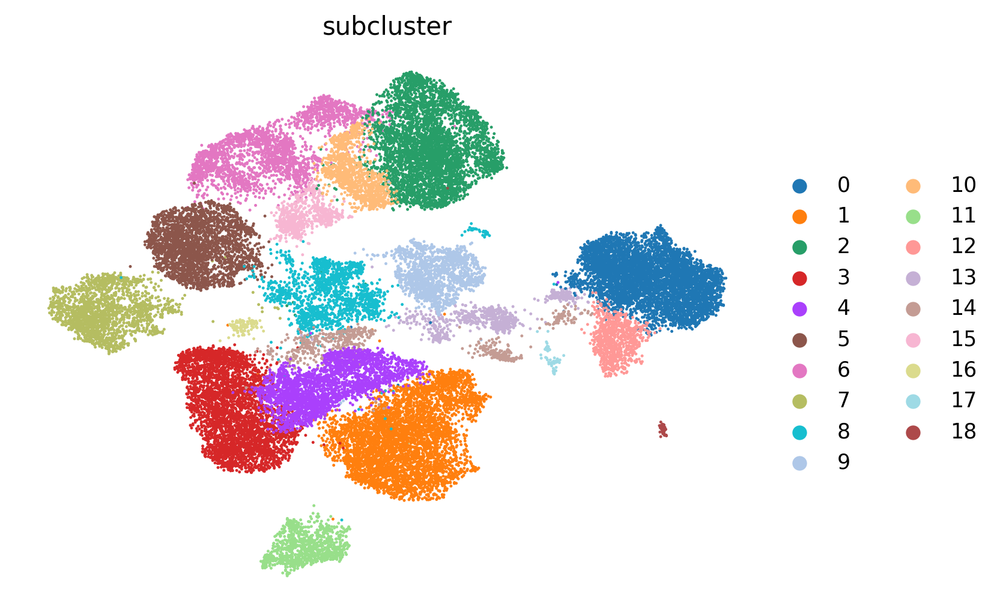

# Projet : Etude multi-cohortes de données snRNA-seq  via scVI pour une identification locale des mécanismes biologiques impliqués dans la SLA.

## English summary

This project analyzes single-nucleus RNA-seq datasets in Amyotrophic Lateral Sclerosis (ALS) using scVI for multi-cohort integration, cell-type annotation, differential expression, and pathway enrichment analysis.
The goal is to identify robust and tissue-specific transcriptional alterations across independent datasets.

## TL;DR

Pipeline Python d’analyse snRNA-seq sur la SLA utilisant scVI pour intégrer plusieurs cohortes, annoter les cellules, détecter des différences d’expression et identifier des pathways biologiques spécifiques.

## Tech Stack
- Python
- Scanpy
- scvi-tools
- PyTorch
- scikit-learn
- pandas / numpy
- R
- edgeR
- GSEA
- AnnData / h5ad


## Introduction

La SLA (Sclérose Latérale Amyotrophique) est une maladie neurodégénérative des motoneurones.
La mort progressive de ces cellules entraîne une paralysie croissante, pouvant atteindre les muscles respiratoires.

À ce jour, il n’existe aucun remède, et le décès survient le plus souvent quelques années après l’apparition des premiers symptômes.

De nombreux mécanismes biologiques impliqués dans la maladie ont déjà été décrits, mais leur organisation et leur expression à l’échelle locale restent encore mal comprises.

Les technologies transcriptomiques à résolution cellulaire, comme le snRNA-seq, permettent d’étudier l’hétérogénéité des cellules au sein d’une même région, contrairement au bulk RNA-seq.

Ces données représentent une opportunité pour mieux comprendre les mécanismes biologiques impliqués dans la maladie.

## Objectif

Étudier les altérations transcriptionnelles associées à la SLA à travers plusieurs cohortes indépendantes et plusieurs régions du système nerveux en utilisant l’algorithme scVI.

L’objectif est d’identifier des signaux robustes entre cohortes et entre tissus, ou au contraire des signaux spécifiques à certaines régions.


## Données

Trois jeux de données GEO sont utilisés :

* **GSE219280** : https://www.ncbi.nlm.nih.gov/geo/query/acc.cgi?acc=GSE219280
  Composé de 12 individus (6 SLA et 6 contrôles). Pour chacun d’eux, les données snRNA-seq sont disponibles pour le cortex frontal (**FCX**) et le cortex moteur (**MCX**), soit 24 fichiers au total.

* **GSE287257** : https://www.ncbi.nlm.nih.gov/geo/query/acc.cgi?acc=GSE287257
  Composé de 12 individus (8 SLA et 4 contrôles). Les données snRNA-seq sont disponibles pour le cortex préfrontal (**PFX**).

* **GSE290359** : https://www.ncbi.nlm.nih.gov/geo/query/acc.cgi?acc=GSE290359
  Composé de 48 individus (36 SLA et 12 contrôles). Les données snRNA-seq sont disponibles pour la moelle épinière (**SC**).

## Pré-traitement pour scVI

Pour utiliser scVI, les datasets sont d’abord harmonisés. Seuls les gènes communs aux trois jeux de données sont conservés.

Les étapes de pré-traitement sont les suivantes :

1. **Sélection des gènes communs** aux trois datasets.
2. **Filtrage HVG** afin de conserver les 3000 gènes les plus variables.
3. **Contrôle qualité (QC)** : conservation des cellules exprimant au moins 200 gènes et contenant moins de 20 % de gènes mitochondriaux (`MT-`).
4. **Suppression des gènes rares**, exprimés dans moins de 3 cellules.
5. **Fusion des datasets** dans un unique fichier `.h5ad` prêt à être utilisé avec scVI.

**Remarque :** scVI nécessite l’utilisation des données brutes (*raw counts*).


## scVI (Single-cell Variational Inference)

### Présentation

L’harmonisation de données snRNA-seq provenant de plusieurs cohortes peut s’avérer complexe. Chaque dataset produit par un laboratoire possède son propre protocole expérimental, sa technologie de séquençage et sa profondeur de lecture.

Fusionner naïvement plusieurs datasets peut conduire à des clusters correspondant principalement aux cohortes plutôt qu’aux véritables types cellulaires, ce qui masque le signal biologique.

L’objectif recherché est que des cellules de même nature, issues de datasets différents, soient regroupées ensemble après intégration. C’est précisément pour répondre à ce problème que scVI a été développé.

scVI est un modèle probabiliste basé sur un réseau de neurones, conçu spécifiquement pour l’analyse de données scRNA-seq (ici appliqué au snRNA-seq) multi-cohortes.

Son objectif est de préserver le signal biologique tout en corrigeant les biais techniques propres à chaque dataset (*batch effects*).

Pour cela, scVI projette chaque cellule dans un espace latent de faible dimension. Typiquement, une cellule décrite par 3000 gènes est représentée après apprentissage dans un espace d’environ 30 dimensions.

Contrairement à une simple réduction de dimension comme la PCA ou l’UMAP, cette projection est probabiliste, non linéaire et apprise directement à partir des données, ce qui permet de comparer plus fidèlement des cellules issues de cohortes différentes.

### Application dans l’étude

Le modèle est entraîné sur l’ensemble des données, puis utilisé pour projeter toutes les cellules dans l’espace latent appris par scVI :

<table style="width:100%; text-align:center;">
  <tr>
    <td>
      
      <div style="height: 40px;">Figure 1a : UMAP ALS vs Controls</div>
    </td>
    <td>
      
      <div style="height: 40px;">Figure 1b : UMAP par dataset</div>
    </td>
    <td>
      
      <div style="height: 40px;">Figure 1c : UMAP par région</div>
    </td>
  </tr>
</table>

<p style="text-align:center;">
  <b>Figure 1 :</b> Représentations UMAP colorées par condition, dataset et région.
</p>

La figure 1 permet de visualiser l’espace latent généré par scVI. On observe plusieurs clusters correspondant probablement à différents types cellulaires, possiblement dans des états biologiques distincts.

La figure 1a montre que, dans la plupart des clusters, des cellules ALS et contrôles coexistent. Cela suggère que la structure principale de l’espace latent reflète davantage les identités cellulaires que la condition clinique seule.

La figure 1b indique que tous les datasets ne sont pas représentés de manière uniforme dans chaque cluster. Certains clusters contiennent des cellules issues des trois cohortes, tandis que d’autres semblent plus spécifiques à un dataset.

Cela reste biologiquement plausible : deux datasets proviennent du cerveau, tandis qu’un autre provient de la moelle épinière. Les populations cellulaires attendues ne sont donc pas strictement identiques entre tissus.

### Limite importante du design expérimental

Dans cette étude, chaque tissu est présent dans un seul dataset. Cela constitue une limite importante.

En effet, le modèle doit simultanément :

* corriger les différences techniques entre datasets ;
* préserver les différences biologiques entre tissus.

Autrement dit, il doit apprendre à ignorer les effets de cohorte tout en conservant les variations réelles liées à la région anatomique. En l’absence de tissu commun entre cohortes, cette séparation entre signal technique et signal biologique est plus difficile.

### Évaluation du compromis biologique / batch effect

Pour évaluer si scVI mélange trop les datasets — ou au contraire pas assez — un modèle de régression logistique est entraîné pour prédire le dataset d’origine à partir des coordonnées latentes d’une cellule.

* Si la prédiction échoue totalement, cela peut indiquer une sur-correction avec perte d’information biologique.
* Si la prédiction est trop facile, cela suggère que le batch effect reste fortement présent.

L’objectif recherché est donc un compromis entre intégration technique et conservation du signal biologique.

| Région | Precision | Recall | F1-score | Support |
| ------ | --------: | -----: | -------: | ------: |
| FCX    |      0.36 |   0.13 |     0.19 |  14,897 |
| FX     |      0.60 |   0.78 |     0.68 |  33,110 |
| MCX    |      0.39 |   0.19 |     0.26 |  15,270 |
| SC     |      0.56 |   0.75 |     0.64 |  22,735 |

**Accuracy : 0.55**
**Macro F1-score : 0.44**
**Weighted F1-score : 0.51**

Le modèle de prédiction reste modérément performant, avec une accuracy globale de **55 %** (contre **25 %** attendus pour un tirage aléatoire sur 4 classes).

Certaines régions, comme **FX** et **SC**, semblent bien séparées dans l’espace latent, tandis que **FCX** et **MCX** apparaissent davantage mélangées, ce qui reste biologiquement plausible compte tenu de leur proximité tissulaire.

Globalement, ces résultats suggèrent que scVI a appris un compromis raisonnable entre correction des batch effects et conservation du signal biologique.

## Baseline Pathways

Cette section décrit le pipeline utilisé pour comparer les profils transcriptomiques entre datasets et identifier les enrichissements biologiques (*pathways*) les plus pertinents.

Le pipeline se décompose en trois étapes :

* **Annotation de l’espace latent** : les données initiales ne sont pas annotées par type cellulaire (neurone, astrocyte, etc.). Cette étape permet d’attribuer un type cellulaire à chaque cellule.
* **Pseudobulk Differential Expression (DE)** : comparaison ALS vs contrôles au niveau patient, stratifiée par type cellulaire et région, à l’aide de l’algorithme **edgeR**.
* **GSEA** : analyse d’enrichissement sur les bases de données **MSigDB Hallmark 2020** et **Reactome 2022**. Un tableau récapitulatif des enrichissements significatifs est généré.

### Annotation de l’espace latent

Une approche combinant méthodes classiques et utilisation de l’espace latent est proposée pour annoter automatiquement les cellules.

La première étape consiste à définir des gènes marqueurs pour chaque type cellulaire étudié :

| Type de cellule | Gènes marqueurs             |
| --------------- | --------------------------- |
| Neuron          | RBFOX3, SYT1, SNAP25, MAP2  |
| Excitatory      | SLC17A7, CAMK2A             |
| Inhibitory      | GAD1, GAD2                  |
| Astrocyte       | GFAP, AQP4, SLC1A2          |
| Microglia       | C1QA, C1QB, P2RY12, TMEM119 |
| Oligodendrocyte | MBP, MOG, PLP1              |
| OPC             | PDGFRA, CSPG4               |
| Endothelial     | CLDN5, FLT1, PECAM1         |
| Pericyte        | PDGFRB, RGS5                |

### 1. Score basé sur les marqueurs

Pour chaque gène marqueur **G** et chaque cellule **C**, un score standardisé est calculé :

S(G,C) = (G₍C₎ - μ(G)) / σ(G)

où μ(G) et σ(G) correspondent respectivement à la moyenne et à l’écart-type d’expression du gène **G** dans l’ensemble des cellules (après exclusion des outliers).

Les cellules trop homogènes sont également retirées.

Un score global est ensuite calculé pour chaque type cellulaire en moyennant les scores de ses marqueurs.

Exemple pour le type **Neuron** :

S(Neuron,C) = (S(RBFOX3,C) + S(SYT1,C) + S(SNAP25,C) + S(MAP2,C)) / 4

Chaque cellule dispose ainsi d’un score d’appartenance pour chaque type cellulaire.

### 2. Sélection de cellules de confiance

Un premier ensemble de cellules de confiance est construit en conservant les cellules dont le meilleur score dépasse un seuil défini.

Dans une seconde passe, l’espace latent scVI est utilisé pour renforcer cette sélection.

Pour chaque cellule, on observe ses **15 plus proches voisins** dans l’espace latent et on calcule un score de consistance :

* nombre de voisins du même type / nombre total de voisins

Seules les cellules avec un score supérieur à **0.7** sont conservées comme cellules de confiance.

### 3. Classification finale

Les cellules de confiance servent ensuite à entraîner un petit réseau de neurones prenant en entrée la représentation latente d’une cellule et prédisant son type cellulaire.

Une fois entraîné, ce classifieur est appliqué à l’ensemble des cellules.

Pour les analyses en aval, seules les cellules dont la prédiction est jugée fiable sont conservées :

* probabilité de prédiction supérieure à un seuil ;
* marge suffisante entre la meilleure et la deuxième prédiction.

### Pseudobulk DE

L’analyse de l’expression différentielle (DE) cherche à répondre à la question suivante :

**Dans un type cellulaire donné et une région donnée, quels gènes sont différentiellement exprimés entre individus ALS et contrôles ?**

En single-cell, les cellules provenant d’un même patient ne sont pas indépendantes : elles partagent un contexte biologique commun. Il est donc préférable de raisonner au niveau patient plutôt qu’au niveau cellule individuelle.

Pour cela, les counts sont agrégés par patient, puis séparément par région et par type cellulaire. On obtient ainsi, pour chaque patient, un profil d’expression pseudobulk représentant une population cellulaire donnée dans une région donnée.

Ces profils sont ensuite analysés avec **edgeR**, un outil statistique adapté à l’analyse d’expression différentielle sur données de comptage.

Pour chaque gène (ici les 3000 gènes retenus), edgeR fournit notamment :

* **logFC** : variation d’expression entre ALS et contrôles.

  * `logFC > 0` : gène plus exprimé chez ALS
  * `logFC < 0` : gène plus exprimé chez les contrôles

* **p-value** : probabilité d’observer un effet au moins aussi extrême par hasard.

* **FDR** (*False Discovery Rate*) : correction des tests multiples. Comme des milliers de gènes sont testés simultanément, cette mesure permet de limiter les faux positifs. C’est le critère principal de significativité.

* **logCPM** : niveau moyen d’expression du gène (*counts per million*).

### GSEA

Le **Gene Set Enrichment Analysis (GSEA)** vise à identifier des programmes biologiques complets plutôt que des gènes isolés.

Les résultats de DE sont d’abord filtrés afin de ne conserver que les comparaisons contenant suffisamment de gènes informatifs (*FDR < 0.25*).

Les gènes sont ensuite classés selon le score :

**S = sign(logFC) × (-log10(FDR))**

Cette liste ordonnée est utilisée comme entrée du GSEA.

L’algorithme interroge des bases de données de pathways biologiques, où chaque pathway correspond à un ensemble de gènes associés à une fonction donnée.

Pour chaque pathway, GSEA calcule :

* **NES** (*Normalized Enrichment Score*) : indique si le pathway est enrichi chez ALS ou chez les contrôles.
* **FDR** : niveau de confiance statistique associé à cet enrichissement.

Seuls les pathways vérifiant :

* `|NES| > 1.2`
* `FDR < 0.25`

sont retenus.

Les bases de données utilisées sont :

* **MSigDB Hallmark 2020**
* **Reactome 2022**

### Résultats

Les résultats complets de l’enrichissement sont disponibles dans le tableau ci-dessous.

Pour faciliter la lecture, voici les principales tendances observées :

* **Moelle épinière (SC)** : enrichissement récurrent de signatures inflammatoires (*TNF-alpha signaling via NF-kB*, *Inflammatory Response*, *Interferon Gamma Response*, *Hypoxia*), notamment dans les astrocytes, cellules endothéliales et oligodendrocytes.
* **Neurones excitateurs et neurones globaux (MCX)** : augmentation de voies liées au métabolisme énergétique et à la traduction (*Oxidative Phosphorylation*, *Myc Targets*, *Translation*, *mTORC1 Signaling*).
* **Régions corticales (FCX / FX)** : signatures plus hétérogènes, avec selon les types cellulaires des diminutions de voies métaboliques, synaptiques ou liées à la signalisation.

Ces résultats suggèrent que les altérations biologiques associées à la SLA dépendent fortement du **tissu étudié** et du **type cellulaire considéré**.

### Résultats

Le tableau suivant présente un résumé des enrichissements biologiques les plus marquants observés selon les régions et types cellulaires.

| Région   | Type cellulaire | Pathways dominants                             | Interprétation globale                      |
| -------- | --------------- | ---------------------------------------------- | ------------------------------------------- |
| SC       | Astrocyte       | TNF-alpha Signaling, Interferon Gamma Response | Activation inflammatoire marquée            |
| SC       | Endothelial     | Inflammatory Response, Hypoxia                 | Stress vasculaire et inflammation           |
| SC       | Oligodendrocyte | TNF-alpha Signaling, Hypoxia, Translation      | Réponse au stress et adaptation métabolique |
| MCX      | Excitatory      | Oxidative Phosphorylation, mTORC1, Translation | Hausse énergétique et synthèse protéique    |
| MCX      | Neuron          | Myc Targets, Translation, Metabolism of RNA    | Remodelage métabolique cellulaire           |
| FCX      | Excitatory      | ↓ Oxidative Phosphorylation, ↓ Myc Targets     | Altération métabolique neuronale            |
| FX       | Inhibitory      | ↓ Oxidative Phosphorylation, ↓ mTORC1          | Diminution de l’activité métabolique        |
| FCX / FX | Plusieurs types | Signatures variables selon le type cellulaire  | Hétérogénéité corticale importante          |

Globalement, les résultats mettent en évidence des différences entre régions et types cellulaires. La moelle épinière présente plusieurs enrichissements liés à des processus inflammatoires, tandis que les régions corticales montrent des signatures plus variables selon les tissus et les populations cellulaires étudiées. Ces observations devront toutefois être confirmées par des analyses complémentaires et par l’expertise métier.

**Remarque :** ce tableau est un résumé interprétatif. Les résultats complets de tous les pathways significatifs sont disponibles dans les fichiers d’analyse du projet.

## Analyse des clusters

Dans l'optique d'apporter plus de finesse dans l'analyse, on s'intéresse maintenant aux clustering de l'espace latent.
On s'intéresse à un type de cellule (par exemple astrocyte) et on applique l'algorithme de leiden sur ce sous ensemble de cellules.
Pour chaque cluster, on regarde quels gènes sont statistiquement plus exprimés par rapport aux autres clusters. Grâce à cet ensemble de gènes on peut identifier quel sous type de cellule est décrit par ce cluster.
Certains clusters vont représenter des sous types similaires et doivent etre proches spatialement dans l'espace latent.
On réalise alors pour chaque cluster un pseudobulk DE puis un GSEA pour trouver si les pathways relatifs à la maladie sont différents selon le cluster.

### Exemple pour les neurones inhibiteurs :
On applique le pipeline précédent en rassemblant les régions pour obtenir plus de cellules pour les tests statistiques.

<table style="width:100%; text-align:center;">
  <tr>
    <td>
      
      <div style="height: 40px;">Figure 2a : UMAP ALS vs Controls</div>
    </td>
    <td>
      
      <div style="height: 40px;">Figure 2b : UMAP par region</div>
    </td>
    <td>
      
      <div style="height: 40px;">Figure 2c : UMAP par cluster</div>
    </td>
  </tr>
</table>

<p style="text-align:center;">
  <b>Figure 2 :</b> Clustering sur le sous ensemble des cellules "Inhibitory".
</p>

Pour montrer les résultats que l'on peut obtenir, on regarde maintenant spécifiquement le cluster 10.

| Cluster | Fréquence ALS | Fréquence CTRL | Fold change (ALS/CTRL) | p-value |
|--------:|--------------:|---------------:|-----------------------:|--------:|
| 10 | 0.0181 (1.81%) | 0.0080 (0.80%) | 1.18× | 5.77e-04 |


Le cluster 10 représente **1.81%** des cellules dans les échantillons ALS contre **0.80%** dans les contrôles, soit une **augmentation relative de 1.18×** chez ALS. La différence est statistiquement significative (*p* = 5.77 × 10⁻⁴).


| Rang | Gène | Score marqueur | LogFC | p-value |
|---|---|---:|---:|---:|
| 1 | OLFM3 | 48.94 | 4.24 | 0 |
| 2 | RGS12 | 48.51 | 3.43 | 0 |
| 3 | CNR1 | 46.61 | 3.75 | 0 |
| 4 | KCNQ5 | 41.45 | 2.99 | 0 |
| 5 | ADARB2 | 41.12 | 3.57 | 0 |
| 6 | CNTNAP4 | 40.88 | 2.99 | 0 |
| 7 | ASIC2 | 40.80 | 2.75 | 0 |
| 8 | KCNT2 | 40.46 | 2.83 | 0 |
| 9 | INPP4B | 39.53 | 2.46 | 0 |
| 10 | ALCAM | 39.39 | 2.58 | 0 |
| 11 | CLSTN2 | 38.87 | 3.23 | 0 |
| 12 | CADM2 | 38.80 | 1.31 | 0 |
| 13 | SYNPR | 38.31 | 2.88 | 0 |
| 14 | GALNTL6 | 37.27 | 3.26 | 8.36e-302 |
| 15 | EDIL3 | 37.20 | 2.39 | 1.08e-300 |
| 16 | OLFM1 | 35.93 | 2.49 | 1.67e-280 |
| 17 | VWC2L | 34.96 | 2.94 | 1.48e-265 |
| 18 | GABRA1 | 34.67 | 2.16 | 3.57e-261 |
| 19 | CCDC85A | 34.26 | 2.34 | 3.77e-255 |
| 20 | PTPRE | 33.95 | 2.00 | 1.59e-250 |


Ce tableau liste les gènes les plus caractéristiques du cluster 10. Ils servent à identifier ce groupe de cellules et à mieux comprendre son profil biologique.
N'étant pas biologiste, je ne peux pas dire à quel sous type il correspond. Il semblerait que ce soit des neurones inhibiteurs relativement matures et spécialisés dans la communication synaptique après recherche sur internet.

| Database | Pathway | NES | FDR | Direction |
|---|---|---:|---:|---|
| MSigDB_Hallmark_2020 | Oxidative Phosphorylation | 2.098 | 0.00146 | ALS_up |
| Reactome_2022 | Neurexins And Neuroligins (R-HSA-6794361) | -1.988 | 0.00255 | CTRL_up |
| MSigDB_Hallmark_2020 | Adipogenesis | 1.943 | 0.00365 | ALS_up |
| Reactome_2022 | Protein-protein Interactions At Synapses (R-HSA-6794362) | -1.990 | 0.00509 | CTRL_up |
| MSigDB_Hallmark_2020 | Myc Targets V1 | 1.868 | 0.00535 | ALS_up |
| Reactome_2022 | Translation (R-HSA-72766) | 2.045 | 0.00893 | ALS_up |
| Reactome_2022 | Metabolism Of Amino Acids And Derivatives (R-HSA-71291) | 1.913 | 0.01079 | ALS_up |
| Reactome_2022 | Cellular Response To Starvation (R-HSA-9711097) | 1.936 | 0.01160 | ALS_up |
| Reactome_2022 | L13a-mediated Translational Silencing Of Ceruloplasmin Expression (R-HSA-156827) | 1.914 | 0.01233 | ALS_up |
| Reactome_2022 | Influenza Infection (R-HSA-168255) | 1.876 | 0.01298 | ALS_up |
| Reactome_2022 | Formation Of A Pool Of Free 40S Subunits (R-HSA-72689) | 1.872 | 0.01302 | ALS_up |
| Reactome_2022 | Peptide Chain Elongation (R-HSA-156902) | 1.865 | 0.01305 | ALS_up |
| Reactome_2022 | Cap-dependent Translation Initiation (R-HSA-72737) | 1.942 | 0.01339 | ALS_up |
| MSigDB_Hallmark_2020 | Protein Secretion | 1.748 | 0.02446 | ALS_up |
| MSigDB_Hallmark_2020 | Fatty Acid Metabolism | 1.608 | 0.06833 | ALS_up |

Interprétation avec internet : Ce cluster pourrait représenter des neurones inhibiteurs qui, dans ALS, montrent un état de stress / compensation métabolique avec augmentation des besoins énergétiques et de la machinerie de synthèse protéique, tandis que des fonctions synaptiques semblent relativement plus préservées ou dominantes chez les contrôles.

### Exemple avec astrocytes

Le code fourni permet aussi de faire l'étude des sous-clusters par région. En faisant la meme démarche que pour les 'Inhibitory'. On commence par regarder le cluster 5, car il semble statistiquement plus enrichi que les contrôles.  

| Cluster | Proportion ALS | Proportion CTRL | Effet (log2FC) | p-value |
|---|---:|---:|---:|---:|
| 5 | 0.0483 | 0.0036 | 3.76 | 3.58e-06 |

Ce sous-type représente **~4.8 % des astrocytes chez ALS** contre **~0.36 % chez CTRL**, soit une augmentation marquée.


**Top markers du cluster 5**

| Gène | Score | logFC | p-value |
|---|---:|---:|---:|
| CD44 | 99.66 | 4.15 | 0 |
| GLIS3 | 89.52 | 2.60 | 0 |
| MAN1C1 | 84.87 | 3.41 | 0 |
| TPST1 | 84.70 | 2.92 | 0 |
| DCLK1 | 80.88 | 3.57 | 0 |
| ARHGEF3 | 79.31 | 2.87 | 0 |
| TENM4 | 77.87 | 2.40 | 0 |
| DTNA | 77.38 | 1.44 | 0 |
| MACF1 | 77.02 | 1.39 | 0 |
| CADPS | 76.56 | 3.02 | 0 |
| AQP1 | 69.41 | 2.97 | 0 |


**Signaux diminués dans la moelle épinière**

| Pathway | NES | padj |
|---|---:|---:|
| Cholesterol Homeostasis | -1.71 | 0.0367 |
| Peptide Chain Elongation | -1.72 | 0.0440 |
| Translation Elongation | -1.72 | 0.0440 |
| rRNA Processing | -1.73 | 0.0383 |


Le cluster 5 semble correspondre à un sous-type d’astrocytes rare chez les contrôles mais fortement augmenté dans ALS.  

## Get Started

Une fois le projet cloné, installez les dépendances Python :

```bash
pip install -r requirements.txt
```

### Installation de R

Le pipeline utilise **R** pour les analyses d’expression différentielle avec **edgeR**.

```bash
sudo apt update
sudo apt install r-base -y
```

Puis installez le package **edgeR** :

```bash
R
install.packages("BiocManager")
BiocManager::install("edgeR")
q()
```

---

## Organisation des données

Les données doivent être placées dans l’arborescence suivante :

```text
./root_data/data/219280
./root_data/data/287257
./root_data/data/290359
```

Chaque dossier correspond à un dataset GEO :

* **219280** : https://www.ncbi.nlm.nih.gov/geo/query/acc.cgi?acc=GSE219280
  Télécharger les fichiers `cellBender_corrected_filtered.h5` des samples du dataset et les placer dans ce dossier.
  *(Les patients FTD ne sont pas obligatoires.)*

* **287257** : https://www.ncbi.nlm.nih.gov/geo/query/acc.cgi?acc=GSE287257
  Télécharger les 12 fichiers `filtered_feature_bc_matrix.h5` et les placer dans ce dossier.

* **290359** : https://www.ncbi.nlm.nih.gov/geo/query/acc.cgi?acc=GSE290359
  Télécharger le fichier `GSE290359_BA44_BA46_COUNTS.h5ad` et le placer dans ce dossier.

---

## Utilisation du code

### 1. Préprocessing des données

```python
from preprocessing.pipeline_preprocessing import PipelinePreprocessing

pp = PipelinePreprocessing(root_path="./root_data")
pp.run()
```

---

### 2. Entraînement du modèle scVI

```python
import train_scvi

train_scvi.train_scvi(
    "./root_data/scvi_ready_data/final_scvi.h5ad"
)
```

Le modèle entraîné est automatiquement sauvegardé dans :

```text
./runs/run_n
```

---

### 3. Analyse post-entraînement

```python
from post_analysis.pipeline import PostAnalysisPipeline

pipe = PostAnalysisPipeline(
    "./root_data/scvi_ready_data/final_scvi.h5ad",
    "./runs/run_n/model/"
)
```

### Calcul de l’espace latent

```python
pipe.run_latent()
```

Calcule les embeddings `X_scVI` de toutes les cellules dans l’espace latent.

### Clustering global

```python
pipe.run_clustering(resolution=1.0)
```

Effectue un clustering de l’espace latent.

### Annotation cellulaire

```python
MARKERS = {
    "Neuron": ["RBFOX3", "SYT1", "SNAP25", "MAP2"],
    "Excitatory": ["SLC17A7", "CAMK2A"],
    "Inhibitory": ["GAD1", "GAD2"],
    "Astrocyte": ["GFAP", "AQP4", "SLC1A2"],
    "Microglia": ["C1QA", "C1QB", "P2RY12", "TMEM119"],
    "Oligodendrocyte": ["MBP", "MOG", "PLP1"],
    "OPC": ["PDGFRA", "CSPG4"],
    "Endothelial": ["CLDN5", "FLT1", "PECAM1"],
    "Pericyte": ["PDGFRB", "RGS5"]
}

pipe.run_annotation(MARKERS)
```

Ajoute une annotation `cell_type` aux cellules à partir des gènes marqueurs.

### Differential Expression (pseudobulk)

```python
pipe.run_de(split_by=("cell_type", "region"))
```

Réalise une analyse d’expression différentielle par patient.

### Enrichissement biologique (GSEA)

```python
pipe.run_gsea()
```

Calcule les pathways enrichis à partir des résultats DE.

### Sous-clustering d’un type cellulaire

```python
pipe.run_subcluster_analysis(
    "Astrocyte",
    split_by=("subcluster", "region")
)
```

Analyse les sous-populations d’un type cellulaire donné.

---

## Ressources matérielles

Certaines fonctions sont gourmandes en mémoire vive. Il est recommandé de lancer les étapes une par une plutôt que tout exécuter d’un seul bloc, sauf si vous disposez d’au moins **32 Go de RAM**.

Le pipeline a été développé et testé sur :

* **OS** : Ubuntu 24.04
* **RAM** : 16 Go
* **GPU** : NVIDIA GeForce RTX 5060 (8 Go VRAM)
* **CPU** : AMD Ryzen 5 8400F

Pour toute question ou remarque :

- GitHub : @tonpseudo
- Email : ton.email@exemple.com


