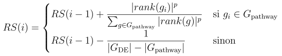
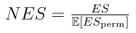

# Explication de GSEA

Pour calculer les pathways enrichis, GSEA prend la liste des gènes triée d'une manière quelconque (plusieurs rankings peuvent être pertinents, on en choisit un).
Pour chaque pathway de sa base de données, elle va calculer un score d'enrichissement.

## Calcul de l'ES (Enrichment Score) :

Supposons que Gpathway soit l'ensemble des gènes d'un pathway et GDE l'ensemble des gènes de notre étude.

On parcourt chaque gène de notre dataset. S'il est dans le pathway que l'on étudie, alors on ajoute la quantité de la première ligne. Cette quantité favorise les gènes bien classés pour p>1 (on prend p=2 par exemple).
Si le gène n'y est pas, alors on retire une petite quantité dépendant de la taille de Gpathway.

On parcourt comme ça tous les gènes dans l'ordre trié et on ajoute le score du gène i dans la somme partielle à chaque itération.
Pendant ce calcul, on garde en mémoire la valeur minimale et maximale qu'a prise cette somme partielle. 

On attribue deux ES au pathway étudié. Le premier correspond au minimum des sommes partielles et le second au maximum.

L'idée étant que parmi tous les pathways, ceux ayant un ES très élevé ou au contraire très faible sont intéressants.
## Calcul du NES (Normalized Enrichment Score) :

On définit le NES pour un pathway de la manière suivante :

L'idée est de comparer les scores obtenus pour chaque pathway à ce qu'on pourrait obtenir par hasard.
Pour cela, on fait un certain nombre de tirages aléatoires de rankings (1000 dans notre cas) et on regarde en moyenne quel est le score du pathway.
Le NES correspond au ratio entre le score de notre pathway avec notre ranking et le score moyen avec un ranking au hasard.

La pvalue empirique est calculée en comptant combien de fois un ranking a un meilleur ES qu'avec notre ranking. On divise cette valeur par le nombre de tirages effectués et on obtient la pvalue empirique.
Ainsi un pathway ayant un NES < 0 avec une pvalue empirique < 0.05 indique qu'il est significativement moins présent chez les individus étudiés qu'un ranking de gènes tiré aléatoirement.
Meme raisonnement avec un NES > 0, les patients étudiés expriment significativement le pathway par rapport à un tirage au hasard.
