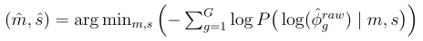

# Explication de edgeR

L’idée est de définir un modèle avec des coefficients &beta; qui expliquent l’expression d’un gène (un vecteur &beta; par gène), idéalement pour tous les échantillons, de la manière suivante :

log(&mu;i) = Xi &beta; avec &mu;i la valeur moyenne du gène pour l’échantillon i et Xi la ligne de la design matrix correspondante.

## Exemple

Prenons des données exemples pour illustrer ce qu’il se passe avec deux conditions et 3 régions :

| sample | condition | region | counts (gene X) |
|--------|-----------|--------|------------------|
| S1     | ALS       | A      | 10               |
| S2     | CTRL      | A      | 12               |
| S3     | ALS       | B      | 20               |
| S4     | CTRL      | B      | 24               |
| S5     | ALS       | C      | 5                |
| S6     | CTRL      | C      | 7                |

Ce que l’on appelle design correspond à définir à quoi correspond le vecteur &beta; :

- β0 (Intercept)  
  → expression de base (ALS + région A)

- β_conditionCTRL  
  → effet global CTRL vs ALS (dans la région de référence A)

- β_regionB  
  → effet de la région B vs région A (chez ALS)

- β_regionC  
  → effet de la région C vs région A (chez ALS)

- β_conditionCTRL:regionB  
  → différence du contraste CTRL vs ALS spécifiquement en région B

- β_conditionCTRL:regionC  
  → différence du contraste CTRL vs ALS spécifiquement en région C

Le vecteur &beta; est donc :  
(β0, β_conditionCTRL, β_regionB, β_regionC, β_conditionCTRL:regionB, β_conditionCTRL:regionC)

Voici maintenant X, la design matrix correspondant aux données :

Référence :
- condition = ALS  
- region = A  

| sample | Intercept | conditionCTRL | regionB | regionC | conditionCTRL:regionB | conditionCTRL:regionC |
|--------|-----------|--------------|---------|---------|------------------------|------------------------|
| S1     | 1         | 0            | 0       | 0       | 0                      | 0                      |
| S2     | 1         | 1            | 0       | 0       | 0                      | 0                      |
| S3     | 1         | 0            | 1       | 0       | 0                      | 0                      |
| S4     | 1         | 1            | 1       | 0       | 1                      | 0                      |
| S5     | 1         | 0            | 0       | 1       | 0                      | 0                      |
| S6     | 1         | 1            | 0       | 1       | 0                      | 1                      |

Concrètement, prenons par exemple l’échantillon 6. Le modèle essaye d’estimer les betas de la manière suivante :

log(7) = β0 + β_conditionCTRL + β_regionC + β_conditionCTRL:regionC

Pour l’échantillon 2 :

log(12) = β0 + β_conditionCTRL

Pour l’échantillon i :

log(&mu;i) = Xi &beta;

## estimation des &beta; et &phi; :

Pour estimer ces valeurs, le modèle suppose que, pour un gène, les valeurs des échantillons suivent une loi NB(&beta;, &phi;) (ce qui est cohérent biologiquement).  
L'idée générale est la suivante : Étant donné le faible nombre d'individus et la grande dispersion des counts entre ces individus pour un même gène, la recherche des paramètres de la loi NB par gène peut être bruitée et instable.  
On réalise donc la recherche de ces paramètres un par un et on suppose que les &phi; des différents gènes suivent une loi normale de paramètres m et s. On utilise cette hypothèse pour améliorer la stabilité dans la recherche des &phi;.  
En effet l'idée consiste à contraindre la recherche de &phi; pour que la loi NB permette de bien prédire nos données tout en imposant que ces &phi; ne soient pas trop éloignés sur la gaussienne qui modélise leur distribution. 

Pour cela edgeR réalise plusieurs étapes :
- première estimation des &beta; avec &phi; fixé grossièrement.
- première estimation des &phi;
- estimation de m et s qui dépendent de &phi;
- estimation finale des &phi; via shrinkage
- estimation finale des &beta;

### première estimation des &beta; :

On commence par fixer &phi; grossièrement. L'idée est, un peu comme dans scVI, de minimiser la fonction de coût suivante :

L'idée est de calculer la probabilité d'observer le count Yig, du gène g et du patient i, en supposant que la moyenne &mu;ig dépend de &beta;g comme décrit au dessus.  
Si la probabilité est proche de 0 le terme dans la fonction de coût tend vers l'infini. Si la probabilité tend vers 1, le terme de la fonction de coût tend vers 0.  
on fait ce calcul pour tous les counts des patients et on optimise la somme. 

### première estimation des &phi; :

On fait exactement la même chose que pour les &beta; en initialisant ces derniers avec les valeurs trouvées précédemment :

### estimation des paramètres m et s :

On suppose que les log(&phi;) de chaque gène suivent une loi normale de paramètres m et s.  
On cherche alors à trouver m et s qui minimisent la fonction de coût suivante :

### estimation finale des &phi; via shrinkage

C'est l'étape clé, on cherche de nouveau les &phi; mais cette fois en imposant la contrainte supplémentaire qu'ils soient vraisemblables vis-à-vis de la loi normale qu'ils suivent (qui dépend de m et s calculés juste avant).  
Pour cela on utilise la fonction de coût suivante :

### estimation finale des &beta;

On finit par une dernière passe qui correspond exactement à la première estimation des &beta; mais avec &phi; initialisé avec son estimation finale.  
L'algorithme retourne alors &beta;final et &phi;final.

### Réalisation des différentes optimisations

Dans toutes les optimisations réalisées ci-dessus, différents algorithmes peuvent être mis en œuvre pour les réaliser, mais la fonction de coût est suffisamment simple pour en calculer le gradient explicitement sans avoir besoin d'utiliser un algorithme de rétro-propagation comme en deep learning.

## calcul des logFC, t-stat, pvalue et FDR :

Une fois ces &beta; et &phi; obtenus, on en déduit avec des formules déterministes les différentes valeurs statistiques qui nous intéressent.  
Ici c'est essentiellement une application des formules.