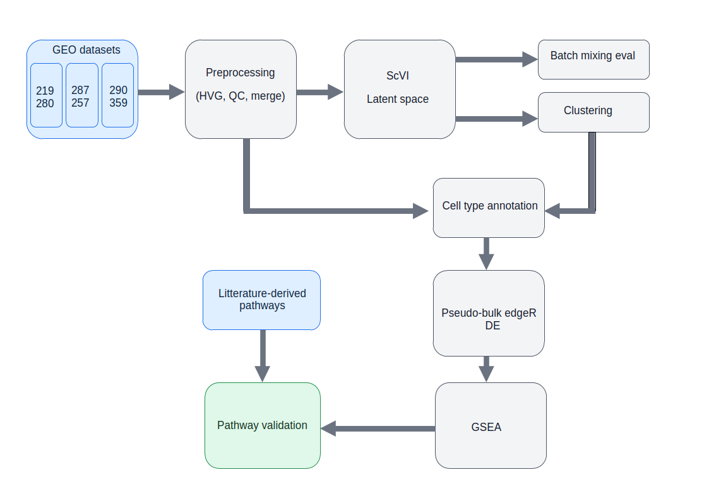

# Projet : Etude multi-cohortes de données snRNA-seq  via scVI pour une identification locale des mécanismes biologiques impliqués dans la SLA.


<p align="center">
<b></b> Pipeline d’analyse snRNA-seq multi-cohortes basé sur scVI, edgeR et GSEA.
</p>


## English summary

This project analyzes single-nucleus RNA-seq datasets in Amyotrophic Lateral Sclerosis (ALS) using scVI for multi-cohort integration, cell-type annotation, differential expression, and pathway enrichment analysis.
The goal is to identify robust and tissue-specific transcriptional alterations across independent datasets.

## TL;DR

Pipeline Python d’analyse snRNA-seq sur la SLA utilisant scVI pour intégrer plusieurs cohortes, annoter les cellules, détecter des différences d’expression et identifier des pathways biologiques spécifiques.

## Tech Stack
- Python
- Scanpy
- scvi-tools
- PyTorch
- scikit-learn
- pandas / numpy
- R
- edgeR
- GSEA
- AnnData / h5ad


## Introduction

La SLA (Sclérose Latérale Amyotrophique) est une maladie neurodégénérative des motoneurones.
La mort progressive de ces cellules entraîne une paralysie croissante, pouvant atteindre les muscles respiratoires.

À ce jour, il n’existe aucun remède, et le décès survient le plus souvent quelques années après l’apparition des premiers symptômes.

De nombreux mécanismes biologiques impliqués dans la maladie ont déjà été décrits, mais leur organisation et leur expression à l’échelle locale restent encore mal comprises.

Les technologies transcriptomiques à résolution cellulaire, comme le snRNA-seq, permettent d’étudier l’hétérogénéité des cellules au sein d’une même région, contrairement au bulk RNA-seq.

Ces données représentent une opportunité pour mieux comprendre les mécanismes biologiques impliqués dans la maladie.

## Objectif

Étudier les altérations transcriptionnelles associées à la SLA à travers plusieurs cohortes indépendantes et plusieurs régions du système nerveux en utilisant l’algorithme scVI.

L’objectif est d’identifier des signaux robustes entre cohortes et entre tissus, ou au contraire des signaux spécifiques à certaines régions.

## Donnees

Trois jeux de données GEO sont utilisés :

* **GSE219280** : https://www.ncbi.nlm.nih.gov/geo/query/acc.cgi?acc=GSE219280
  Composé de 12 individus (6 SLA et 6 contrôles). Pour chacun d’eux, les données snRNA-seq sont disponibles pour le cortex frontal (**FCX**) et le cortex moteur (**MCX**), soit 24 fichiers au total.

* **GSE287257** : https://www.ncbi.nlm.nih.gov/geo/query/acc.cgi?acc=GSE287257
  Composé de 12 individus (8 SLA et 4 contrôles). Les données snRNA-seq sont disponibles pour le cortex préfrontal (**PFX**).

* **GSE290359** : https://www.ncbi.nlm.nih.gov/geo/query/acc.cgi?acc=GSE290359
  Composé de 48 individus (36 SLA et 12 contrôles). Les données snRNA-seq sont disponibles pour la moelle épinière (**SC**).

## Pre-traitement pour scVI

Pour utiliser scVI, les datasets sont d’abord harmonisés. Seuls les gènes communs aux trois jeux de données sont conservés.

Les étapes de pré-traitement sont les suivantes :

1. **Sélection des gènes communs** aux trois datasets.
2. **Filtrage HVG** afin de conserver les 3000 gènes les plus variables.
3. **Contrôle qualité (QC)** : conservation des cellules exprimant au moins 200 gènes et contenant moins de 20 % de gènes mitochondriaux (`MT-`).
4. **Suppression des gènes rares**, exprimés dans moins de 3 cellules.
5. **Fusion des datasets** dans un unique fichier `.h5ad` prêt à être utilisé avec scVI.

**Remarque :** scVI nécessite l’utilisation des données brutes (*raw counts*).

## scVI

### Présentation

L’harmonisation de données snRNA-seq provenant de plusieurs cohortes peut s’avérer complexe. Chaque dataset produit par un laboratoire possède son propre protocole expérimental, sa technologie de séquençage et sa profondeur de lecture.

Fusionner naïvement plusieurs datasets peut conduire à des clusters correspondant principalement aux cohortes plutôt qu’aux véritables types cellulaires, ce qui masque le signal biologique.

L’objectif recherché est que des cellules de même nature, issues de datasets différents, soient regroupées ensemble après intégration. C’est précisément pour répondre à ce problème que scVI a été développé.

scVI (Single-cell Variational Inference) est un modèle probabiliste basé sur un réseau de neurones, conçu spécifiquement pour l’analyse de données scRNA-seq (ici appliqué au snRNA-seq) multi-cohortes.

Son objectif est de préserver le signal biologique tout en corrigeant les biais techniques propres à chaque dataset (*batch effects*).

Pour cela, scVI projette chaque cellule dans un espace latent de faible dimension. Typiquement, une cellule décrite par 3000 gènes est représentée après apprentissage dans un espace d’environ 30 dimensions.

Contrairement à une simple réduction de dimension comme la PCA ou l’UMAP, cette projection est probabiliste, non linéaire et apprise directement à partir des données, ce qui permet de comparer plus fidèlement des cellules issues de cohortes différentes.

### Limite importante du design expérimental

Dans cette étude, chaque tissu est présent dans un seul dataset. Cela constitue une limite importante.

En effet, le modèle doit simultanément :

* corriger les différences techniques entre datasets ;
* préserver les différences biologiques entre tissus.

Autrement dit, il doit apprendre à ignorer les effets de cohorte tout en conservant les variations réelles liées à la région anatomique. En l’absence de tissu commun entre cohortes, cette séparation entre signal technique et signal biologique est plus difficile.

### Évaluation du compromis biologique / batch effect

Pour évaluer si scVI mélange trop les datasets — ou au contraire pas assez — un modèle de régression logistique est entraîné pour prédire le dataset d’origine à partir des coordonnées latentes d’une cellule.

* Si la prédiction échoue totalement, cela peut indiquer une sur-correction avec perte d’information biologique.
* Si la prédiction est trop facile, cela suggère que le batch effect reste fortement présent.

L’objectif recherché est donc un compromis entre intégration technique et conservation du signal biologique.

| Région | Precision | Recall | F1-score | Support |
| ------ | --------: | -----: | -------: | ------: |
| FCX    |      0.36 |   0.13 |     0.19 |  14,897 |
| FX     |      0.60 |   0.78 |     0.68 |  33,110 |
| MCX    |      0.39 |   0.19 |     0.26 |  15,270 |
| SC     |      0.56 |   0.75 |     0.64 |  22,735 |

**Accuracy : 0.55**
**Macro F1-score : 0.44**
**Weighted F1-score : 0.51**

Le modèle de prédiction reste modérément performant, avec une accuracy globale de **55 %** (contre **25 %** attendus pour un tirage aléatoire sur 4 classes).

Certaines régions, comme **FX** et **SC**, semblent bien séparées dans l’espace latent, tandis que **FCX** et **MCX** apparaissent davantage mélangées, ce qui reste biologiquement plausible compte tenu de leur proximité tissulaire.

Globalement, ces résultats suggèrent que scVI a appris un compromis raisonnable entre correction des batch effects et conservation du signal biologique.

## Baseline Pathways

Cette section décrit le pipeline utilisé pour comparer les profils transcriptomiques entre datasets et identifier les enrichissements biologiques (*pathways*) les plus pertinents.

Le pipeline se décompose en trois étapes :

* **Annotation des cellules** : les données initiales ne sont pas annotées par type cellulaire (neurone, astrocyte, etc.). Cette étape permet d’attribuer un type cellulaire à chaque cellule.
* **Pseudobulk Differential Expression (DE)** : comparaison ALS vs contrôles au niveau patient, stratifiée par type cellulaire et région, à l’aide de l’algorithme **edgeR**.
* **GSEA** : analyse d’enrichissement sur les bases de données **MSigDB Hallmark 2020** et **Reactome 2022**. Un tableau récapitulatif des enrichissements significatifs est généré.

### Annotation cellulaire

L'annotation des cellules se fait en deux temps :

* **annotation des clusters** : on commence par annoter les clusters à l'aide de l'espace latent.
* **annotation des cellules** : on se sert de cette annotation pour initialiser l'annotation des cellules.
* **calcul des métriques** : une fois l'annotation réalisée, on vérifie que cette dernière est cohérente.

Pour la suite de la démarche, on définit des gènes marqueurs qui caractérisent des types cellulaires :

| Type de cellule | Gènes marqueurs             |
| --------------- | --------------------------- |
| Neuron          | RBFOX3, SYT1, SNAP25, MAP2  |
| Excitatory      | SLC17A7, CAMK2A             |
| Inhibitory      | GAD1, GAD2                  |
| Astrocyte       | GFAP, AQP4, SLC1A2          |
| Microglia       | C1QA, C1QB, P2RY12, TMEM119 |
| Oligodendrocyte | MBP, MOG, PLP1              |
| OPC             | PDGFRA, CSPG4               |
| Endothelial     | CLDN5, FLT1, PECAM1         |
| Pericyte        | PDGFRB, RGS5                |

#### Annotation des clusters

Pour annoter un cluster c, on regarde quels gènes sont plus exprimés dans ce cluster par rapport aux autres.  
Pour cela, on réalise un DE (Differential Expression) avec l'algorithme edgeR.  
Il s'agit d'un test statistique qui permet de répondre à la question posée. Pour chaque gène,  
l'algorithme retourne deux valeurs : logFC et FDR. LogFC indique à quel point le gène est plus exprimé dans le cluster par rapport aux autres (négatif s'il est moins exprimé que dans les autres clusters, positif sinon).  
FDR indique la confiance dans le résultat (0,05 correspond à une confiance de 95 % par exemple).

Ces deux valeurs permettent d'attribuer un score pour chaque gène dans le cluster de la manière suivante :

S(G) = logFC * (-10 log(FDR + ε))

On finit par calculer la moyenne des scores pour chaque type cellulaire et on annote le cluster avec le score moyen le plus grand.  
Plus précisément, on vérifie que le score n'est pas trop faible, auquel cas on n'annote pas. Si le deuxième score est trop proche  
du premier, on l'annote comme un cluster mixte.

#### Annotation des cellules

Pour annoter les cellules, on se base sur le calcul de 3 scores par type de cellules :

- Un score de voisinage S<sub>N</sub>. Pour chaque type cellulaire, on compte le nombre de voisins les plus proches dans l'espace latent et on le divise par le nombre de voisins observés.
- Un score de gènes marqueurs S<sub>MARKERS</sub>. On commence par classer les gènes par counts décroissants. Puis on calcule l'AUC normalisée sur ces gènes pour chaque type cellulaire.
- Un score de distance au centroïde S<sub>C</sub>. Pour chaque type cellulaire, on calcule le centroïde dans l'espace latent et on prend la distance entre la cellule et ce centroïde. On divise par le maximum des distances pour normaliser.

On pondère pour obtenir le score final d'une cellule de la manière suivante :

S<sub>total</sub> = 0.4 S<sub>N</sub> + 0.35 S<sub>MARKERS</sub> + 0.25 S<sub>C</sub>

En pratique, cette annotation se fait de manière itérative. On initialise les scores des cellules avec S<sub>MARKERS</sub>  
pour pouvoir calculer les autres scores, puis on calcule S<sub>total</sub> et on suppose que le type de la cellule est celui pour lequel S<sub>total</sub> est le plus grand.  
Une fois cette nouvelle annotation faite, on recommence et on observe à l'itération i : mean(||S<sub>total, i+1</sub> - S<sub>total, i</sub>||).  
On s'arrête une fois que cette norme est inférieure à un certain delta.

#### Métriques

Pour se donner une idée de la qualité de l’annotation, différentes métriques sont calculées :

**UMAP :**
<table style="width:100%; text-align:center;">
  <tr>
    <td>
      
      <div style="height: 40px;">Figure 1a : UMAP ALS vs Controls</div>
    </td>
    <td>
      
      <div style="height: 40px;">Figure 1b : UMAP par région</div>
    </td>
    <td>
      
      <div style="height: 40px;">Figure 1c : UMAP par cluster</div>
    </td>
  </tr>
</table>

La figure 1 permet de visualiser comment scVI a appris à représenter les cellules dans l’espace latent. On voit avec la figure 1a que les conditions sont bien mélangées.  
Avec la figure 1b, on observe que les régions sont également mélangées, bien que la région de la moelle épinière semble légèrement à l’écart.  
Cela peut être interprété comme une différence biologique plutôt qu’un batch effect, même si cela reste une hypothèse. La figure 1c montre comment l’annotation de chaque cellule a été réalisée.  
On observe que, mis à part quelques clusters mixtes, l’annotation cellulaire correspond globalement à une annotation par cluster.

**Dotplot markers**


Le dotplot des marqueurs permet de visualiser le score moyen des cellules dans chaque cluster par type cellulaire.  
Lorsque le cluster est bien homogène, on observe une seule couleur vive sur la ligne. Lorsqu’il est mixte, plusieurs couleurs d’intensité similaire sont présentes.  
On observe qu’il existe de nombreux clusters correspondant à des neurones ou à des oligodendrocytes.

**Autres métriques :**

On regarde différentes métriques par cluster :

- **KNN purity :** moyenne, sur l’ensemble des cellules d’un cluster, du nombre de voisins du même type que la cellule rapporté au nombre total de voisins.
- **Patient mixing :** moyenne, sur l’ensemble des cellules d’un cluster, du nombre de voisins provenant de patients différents rapporté au nombre total de voisins.
- **Silhouette :** score entre 0 et 1 indiquant si le cluster est bien séparé des autres (0 : pas du tout, 1 : parfaitement séparé).
- **AUC separation :** différence entre l’AUC obtenue sur le ranking des gènes du type cellulaire de la cellule et le maximum des AUC obtenues pour les autres types cellulaires. Cette valeur est moyennée par cluster. Une valeur élevée indique une plus grande confiance dans l’annotation.

| Cluster | KNN purity | Patient mixing | Silhouette | AUC separation |
|---------|------------|----------------|-------------|-----------------|
| 0  | 0.9999812 | 0.5298145472910281 | 0.10543973 | 0.5916693092796823 |
| 1  | 0.9844248 | 0.521487596063689 | 0.034940958 | 0.0034920301094490958 |
| 2  | 0.9891347 | 0.49445455579570013 | 0.04358642 | 0.22472557160732565 |
| 3  | 0.8020618 | 0.43717148924873905 | 0.16762199 | 0.1764169100079639 |
| 4  | 0.9999878 | 0.4700592235139285 | 0.14220202 | 0.8976627428042211 |
| 5  | 0.9899557 | 0.41178039452495974 | 0.16957031 | 0.23216082930756832 |
| 6  | 0.948381 | 0.4228526843967338 | 0.05632982 | 0.32444812139311513 |
| 7  | 0.55159646 | 0.6017629179331307 | 0.24364752 | 0.17783326096396002 |
| 8  | 0.92674404 | 0.4724888867491534 | 0.12217827 | 0.03533773048962496 |
| 9  | 0.9999612 | 0.5198953386956101 | 0.004589626 | 0.6489404658074105 |
| 10 | 0.99469155 | 0.5561152164077816 | 0.06916727 | 0.3198612577288493 |
| 11 | 0.9829955 | 0.5124499907267572 | 0.11961709 | 0.24789364915348544 |
| 12 | 0.94367343 | 0.6850111092121005 | 0.059464067 | 0.04988463510511021 |
| 13 | 0.9896458 | 0.5548039678790742 | 0.11046562 | 0.22494095418044402 |
| 14 | 0.9713554 | 0.6878297240774472 | 0.18714653 | 0.011738514470754913 |
| 15 | 0.949202 | 0.6437130994553003 | 0.10891711 | 0.12872814535481658 |
| 16 | 0.9858981 | 0.5987602665426933 | 0.100313924 | 0.3397257089725708 |
| 17 | 0.82313097 | 0.603621006857334 | 0.058339335 | 0.23018063221274465 |
| 18 | 0.87018305 | 0.48846101694915256 | 0.03274032 | 0.36126553672316375 |
| 19 | 0.9839354 | 0.6133615167819626 | 0.2808659 | 0.010905073020753275 |
| 20 | 0.6684354 | 0.4158246307272556 | 0.23189943 | 0.17301721704769973 |
| 21 | 0.85055983 | 0.6191884951206985 | 0.05656174 | 0.34260400616332815 |
| 22 | 0.93344194 | 0.5272747014115092 | 0.43014935 | 0.3043973941368079 |
| 23 | 0.9955235 | 0.5767990373044525 | 0.24413314 | 0.24467509025270762 |
| 24 | 0.99660283 | 0.5753282737019636 | 0.25575256 | 0.23509215757137691 |
| 25 | 0.8459624 | 0.6455381134210154 | -0.0075063165 | 0.09857163060387492 |
| 26 | 0.7936715 | 0.44476500697999066 | 0.10962577 | 0.15844578873894843 |
| 27 | 0.9905133 | 0.621832358674464 | 0.37589124 | 0.5012183235867447 |
| 28 | 0.944898 | 0.4581254724111867 | 0.05955302 | 0.5410997732426304 |
| 29 | 0.9811578 | 0.6133181990162694 | 0.40367448 | 0.20332009080590235 |
| 30 | 0.9141892 | 0.5608671171171171 | 0.19382991 | 0.5132319819819819 |
| 31 | 0.86330724 | 0.32803284807764094 | 0.39451948 | 0.35610302351623746 |
| 32 | 0.8765499 | 0.6434860736747529 | 0.25066102 | 0.4773135669362084 |
| 33 | 0.96028364 | 0.4815602836879433 | 0.20630193 | 0.5379939209726443 |
| 34 | 0.835775 | 0.44161358811040335 | 0.3277884 | 0.2022292993630574 |
| 35 | 0.9972056 | 0.6513639387890885 | 0.4060737 | 0.2719560878243513 |
| 36 | 0.9184629 | 0.4070175438596491 | 0.23307657 | 0.3571428571428572 |
| 37 | 0.9897763 | 0.3691160809371672 | 0.2955707 | 0.057507987220447254 |
| 38 | 0.9984762 | 0.5169523809523809 | — | 0.020000000000000018 |

Ces métriques semblent indiquer que, malgré le fait que certains clusters soient probablement des artefacts, de l'information biologique est présente dans cet espace.  
Les cellules sont regroupées par type et mélangées entre patients. Les clusters semblent plutôt former un continuum au vu des scores de silhouette. Les annotations paraissent relativement robustes au regard des valeurs d’AUC separation.

#### Limites de la méthode

Cette méthode n'est pas la plus robuste et il faudrait utiliser un atlas de cellules déjà annotées et le projeter dans l'espace latent. On propage ensuite cette annotation dans l'espace latent pour annoter le reste des cellules.
N'ayant pas d'atlas, c'est la méthode proposée qui a été choisie.

### Pseudobulk DE

Il faut faire très attention lorsque l’on manipule les counts bruts des cellules. Dès que l’on souhaite les comparer, il faut garder à l’esprit que le batch effect est présent. 

Lorsque l’on réalise un DE, par exemple, on ne peut pas comparer directement cellule à cellule.  
Pour cela, on réalise un pseudobulk : on somme les counts de chaque cellule par patient, et ce pour chaque type cellulaire.  
Cela permet de diminuer le bruit normal dans les données et d’éviter un faux sentiment de confiance lié au grand nombre de cellules corrélées (au sein d’un même patient).  
Ce pseudobulk ramène le test statistique à une échelle biologique pertinente : ce sont les individus qui sont biologiquement différents, pas les cellules.  

Ce sont ces counts en pseudobulk qui sont passés à edgeR. edgeR va modéliser ce qui relève du batch effect (différences inter-patients) et ce qui provient réellement de la condition (et d’autres facteurs si on les inclut dans le modèle).

D’une manière générale, dès que l’on ne travaille pas dans l’espace latent, il faut prendre en compte le batch effect d’une manière ou d’une autre.

### Pseudobulk DE par type cellulaire

On travaille sur le sous-ensemble des cellules correspondant au même type cellulaire (l’analyse est réalisée séparément pour chaque type).  
On se pose les questions suivantes :
- quels gènes sont globalement plus exprimés chez les patients malades par rapport aux patients sains ?
- quels gènes diffèrent selon la région ?
- quels gènes présents chez les malades diffèrent entre les régions ?

On modélise le problème de la manière suivante pour edgeR :

design = ~ condition * region

L’idée est de définir un modèle avec des coefficients &beta; qui expliquent l’expression d’un gène (un vecteur &beta; par gène), idéalement pour tous les échantillons, de la manière suivante :

log(&mu;<sub>i</sub>) = X<sub>i</sub> &beta; avec &mu;<sub>i</sub> la valeur moyenne du gène pour l’échantillon i et X<sub>i</sub> la ligne de la design matrix correspondante.

#### Exemple

Prenons des données exemples pour illustrer ce qu’il se passe avec deux conditions et 3 régions :

| sample | condition | region | counts (gene X) |
|--------|-----------|--------|------------------|
| S1     | ALS       | A      | 10               |
| S2     | CTRL      | A      | 12               |
| S3     | ALS       | B      | 20               |
| S4     | CTRL      | B      | 24               |
| S5     | ALS       | C      | 5                |
| S6     | CTRL      | C      | 7                |

Ce que l’on appelle design correspond à définir à quoi correspond le vecteur &beta; :

- β0 (Intercept)  
  → expression de base (ALS + région A)

- β_conditionCTRL  
  → effet global CTRL vs ALS (dans la région de référence A)

- β_regionB  
  → effet de la région B vs région A (chez ALS)

- β_regionC  
  → effet de la région C vs région A (chez ALS)

- β_conditionCTRL:regionB  
  → différence du contraste CTRL vs ALS spécifiquement en région B

- β_conditionCTRL:regionC  
  → différence du contraste CTRL vs ALS spécifiquement en région C

Le vecteur &beta; est donc :  
(β0, β_conditionCTRL, β_regionB, β_regionC, β_conditionCTRL:regionB, β_conditionCTRL:regionC)

Voici maintenant X, la design matrix correspondant aux données :

Référence :
- condition = ALS  
- region = A  

| sample | Intercept | conditionCTRL | regionB | regionC | conditionCTRL:regionB | conditionCTRL:regionC |
|--------|-----------|--------------|---------|---------|------------------------|------------------------|
| S1     | 1         | 0            | 0       | 0       | 0                      | 0                      |
| S2     | 1         | 1            | 0       | 0       | 0                      | 0                      |
| S3     | 1         | 0            | 1       | 0       | 0                      | 0                      |
| S4     | 1         | 1            | 1       | 0       | 1                      | 0                      |
| S5     | 1         | 0            | 0       | 1       | 0                      | 0                      |
| S6     | 1         | 1            | 0       | 1       | 0                      | 1                      |

Concrètement, prenons par exemple l’échantillon 6. Le modèle essaye d’estimer les betas de la manière suivante :

log(7) = β0 + β_conditionCTRL + β_regionC + β_conditionCTRL:regionC

Pour l’échantillon 2 :

log(12) = β0 + β_conditionCTRL

Pour l’échantillon i :

log(&mu;<sub>i</sub>) = X<sub>i</sub> &beta;

**estimation des betas :**

Pour estimer ces valeurs, le modèle suppose que, pour un gène, les valeurs des échantillons suivent une loi NB (ce qui est cohérent biologiquement).  
L’idée est de trouver les betas tels que la valeur moyenne de la loi NB, &mu; = exp(X &beta;), corresponde au mieux aux données.

**calcul des logFC, pvalue et FDR :**

On estime également la variance de la loi NB, qui va servir à calculer l’incertitude sur les valeurs des betas.

Cette incertitude permet de tester statistiquement chaque beta contre l’hypothèse nulle. On en déduit la p-value puis le FDR grâce à ce test.  
Les valeurs des betas correspondent directement aux logFC définis par le design.

#### Limites du DE

Comme expliqué dans la section relative à scVI, une limite importante de la modélisation dans cette étude avec edgeR est que l’on ne sépare toujours pas complètement l’effet biologique lié aux différences entre régions de l’effet technique lié au batch effect.
Les résultats doivent donc être interprétés avec prudence.

### GSEA

On part des résultats du DE (logFC, t-stat et FDR au niveau des gènes) et on les transforme en une analyse de type GSEA (Gene Set Enrichment Analysis).  
Le principe de la GSEA est de ne pas analyser les gènes individuellement, mais de tester si des ensembles de gènes (pathways biologiques comme Hallmark ou Reactome) sont globalement enrichis en haut ou en bas d’un classement de gènes.  

Ici, les gènes sont d’abord nettoyés et agrégés, puis classés selon un score basé sur le t-statistique (qui combine effet et incertitude). Ce ranking est ensuite utilisé pour la GSEA en mode “preranked”, où l’algorithme vérifie si les gènes d’un pathway sont statistiquement concentrés aux extrémités du classement.  
On répète cela pour chaque combinaison de type cellulaire et de contrast (condition, région ou interaction), puis on calcule pour chaque pathway un NES (score d’enrichissement normalisé) et une FDR au niveau des pathways.  
On conserve les résultats significatifs et les plus forts pour l’interprétation biologique.

### Résultats

Voici un résumé réalisé avec un LLM sur les différents pathways obtenus avec GSEA. N'étant pas biologiste, ces résultats sont donc à interpréter avec une très grande prudence. 
On ne conserve que les pathways avec un NES > 1.5, une FDR < .05 et un nombre minimum de gènes dans le pathway de 10 (ou NES > 1.2, une FDR < .1 et un nombre minimum de gènes dans le pathway de 5 pour résultats exploratoire).
La liste de tous les pathways est disponible dans `sources/TOP_PATHWAYS.csv`.


Astrocytes :

Les astrocytes montrent une signature dominante région_FX marquée par une forte activation du métabolisme mitochondrial (OXPHOS, import mitochondrial) et des voies de sensing des nutriments (mTORC1, Myc, starvation response), indiquant une reprogrammation énergétique intrinsèque. Les processus de localisation protéique et de réorganisation intracellulaire confirment cet axe métabolique et structural. En parallèle, les voies synaptiques sont fortement enrichies mais principalement classées en interaction_SC / interaction_FX, suggérant un rôle de modulation glie–neurone plutôt qu’une activité neuronale propre. Les signaux de stress protéique sont présents mais globalement contextuels, tandis que les voies immuno-inflammatoires en global_condition apparaissent plutôt réprimées.

Endothelial :

Profil global dominé par une forte reprogrammation énergétique avec activation des voies mitochondriales (OXPHOS, respiration, glycolyse) et du sensing des nutriments (mTORC1, starvation), indiquant un état métabolique très dynamique dépendant de l’énergie disponible.

On observe en parallèle une signature neuro-like marquée (synapses, neurotransmission, GABA/glutamate, canaux ioniques), suggérant une forte plasticité de signalisation plutôt qu’un programme purement vasculaire classique.

Les modules de stress (hypoxie, UV, TNF/NF-κB, IFNγ) montrent un état cellulaire activé et sensible à l’environnement inflammatoire et hypoxique, avec adaptation métabolique associée.

Enfin, les directions régionales FX/SC/MCX indiquent une séparation nette entre un programme métabolique (FX), un module signalisation/immunité (SC), et une composante de remodelage/interaction synaptique et transport (MCX), avec quelques signatures globalement répressives sur certains axes inflammatoires et synaptiques.

Excitatory :

Le profil est dominé par une très forte activation des programmes de stress protéique et chaperonnes (HSF1, HSP70/HSP90, heat shock), indiquant une charge protéotoxique élevée et une réponse adaptative majeure au stress cellulaire.

On observe également une activation nette de modules inflammatoires et immuno-like (neutrophil degranulation, ROS/transport vésiculaire), suggérant un état excitatoire associé à des processus de stress et de signalisation extracellulaire intense.

Les voies de signalisation hormonale et de croissance (récepteurs stéroïdiens, estrogen-dependent expression, mTORC1, MYC) indiquent une forte reprogrammation transcriptionnelle couplée à des axes métaboliques et de prolifération.

Enfin, le métabolisme énergétique mitochondrial est très présent mais contrasté selon les modules (OXPHOS à la fois activé et réorganisé selon les régions FX/MCX), ce qui suggère une adaptation énergétique plutôt qu’un simple gain ou perte d’activité.

Inhibitory :

Signature fortement enrichie en métabolisme énergétique (OXPHOS, TCA, glycolyse) avec une cohérence élevée entre régions MCX et FX.
Présence dominante de processus de transport d’électrons mitochondrial et de régulation du fer, suggérant un état énergétique stable mais contraint.
Enrichissement important des voies de signalisation immunitaire et apoptotique, indiquant un couplage métabolisme–stress cellulaire.
Les interactions synaptiques et GABAergiques restent présentes mais secondaires, compatibles avec un rôle régulateur plus que excitateur.


Neurons :

Les résultats montrent une forte activation du métabolisme mitochondrial et des programmes Myc/mTORC1 dans plusieurs régions, notamment MCX, FX et Neuron global, avec enrichissement de l’oxydative phosphorylation et du transport mitochondrial. En parallèle, on observe une activation des réponses au stress (HSF1, HSP, UPR) dans ces mêmes régions, suggérant une forte demande cellulaire. À l’inverse, les voies de transmission synaptique (récepteurs, canaux ioniques, NMDA, GABA) sont globalement inhibées, surtout en SC et MCX. Globalement, le profil évoque une bascule vers un état métabolique actif mais une réduction de la signalisation neuronale fonctionnelle.

Oligodendrocytes :

On observe une forte activation des programmes mitochondriaux, notamment Oxidative Phosphorylation (régions FX, SC et MCX), suggérant une demande énergétique élevée.
Les signatures de signalisation synaptique / neuronal system sont aussi très représentées, surtout en régions FX et MCX, avec des gènes liés aux neurotransmetteurs (GABA, glutamate, synapse).
Des voies de stress cellulaire et réponse aux protéines chaperonnes (heat shock, HSP90/HSPA) sont enrichies dans plusieurs régions (FX, MCX, interaction FX).
On note également des signaux immuno-viraux (SARS-CoV, TCR, allograft rejection) et de signalisation intracellulaire (DARPP-32, G alpha, NF-kB) principalement en régions FX et MCX.
Globalement, les enrichissements suggèrent un état oligodendrocytaire actif, métaboliquement élevé et fortement couplé à des interactions neuronales et au stress cellulaire.

Pericytes :

On observe une forte activation du métabolisme énergétique avec Oxidative Phosphorylation en régions FX et MCX, indiquant une activité mitochondriale élevée.
Les voies de signalisation vasculaire et métabolique sont très représentées, notamment insulin receptor signaling, PPARα / lipid metabolism et glycolyse, surtout en région FX.
Un ensemble important de signatures synaptiques et neuronales (NMDA, glutamate, synapses, plasticité) apparaît en région MCX, suggérant une forte interaction neuro-vasculaire.
On retrouve également des modules de stress cellulaire, hypoxie et ROS, ainsi que des programmes de réponse inflammatoire et immunitaire (IFN-γ, inflammation, apoptose), répartis entre FX, MCX et SC.
Globalement, le profil indique un état de péricyte très actif, couplant métabolisme énergétique, réponse au stress et communication avec le système neuronal et vasculaire.

### Validation

Cette section vise à présenter la méthode utilisée pour comparer les résultats GSEA obtenus avec des pathways connus de la littérature scientifique. Pour cette section, un LLM a été utilisé pour définir les pathways connus,
principalement basé sur 'Molecular and Cellular Mechanisms Affected in ALS' (https://www.mdpi.com/2075-4426/10/3/101), un article qui recense la plupart des pathways et gènes impliqués dans la maladie. On ne teste dans cette section que les effets globaux par type cellulaire.

L'évaluation des résultats se fait de la manière suivante :

- calcul d'un score de comparaison entre deux listes de pathways (deux listes de listes de gènes).
- utilisation de ce score pour calculer pour chaque type cellulaire un score de comparaison avec nos pathways de référence.
- génération stratifiée de listes de gènes aléatoires de même taille que les pathways obtenus avec GSEA pour calculer un score de comparaison avec nos pathways de référence (réalisé 1000 fois).
- calcul de la p-value empirique et autres métriques.

#### score de comparaison / calcul d'un score pour un type cellulaire :

Étant donné deux listes de listes de gènes, on calcule le Jaccard entre chaque couple de listes. La première liste de listes de gènes correspond à une liste de pathways. Le score d'un pathway devient le meilleur score obtenu avec les pathways de référence.
On réalise ce calcul pour chacun des pathways d'un type cellulaire et on moyenne pour obtenir le score d'un type cellulaire.

#### génération de pathways aléatoires et calcul de la p-value empirique :

On veut regarder à quel point ce score est significativement élevé par rapport à des gènes aléatoires dans nos données.
Pour cela, on fait des tirages aléatoires de gènes (même nombre de pathways et même nombre de gènes par pathway) dans l'ensemble des 3000 gènes et on regarde si le score est plus élevé que le score obtenu sur nos données.
Plus précisément, on trie au préalable les gènes en strates. Chaque strate correspond à la rareté des gènes dans nos données. Un gène très peu exprimé dans l'ensemble des cellules ne sera pas dans la même strate qu'un gène très abondant.
On définit 7 strates pour ce calcul. L'idée est de remplacer un gène aléatoirement par un gène de la même strate pour garder une cohérence biologique et ne pas supprimer des gènes "hubs" par exemple présents dans beaucoup de pathways.
On réalise ces tirages 1000 fois par type cellulaire et on compte le nombre de fois où le tirage a un meilleur score que celui calculé sur notre GSEA. On divise ce nombre par le nombre de tirages effectués et on obtient la p-value empirique.
On normalise ce score en fournissant un z-score qui permet de visualiser combien d'écarts-types au-dessus du hasard les résultats se situent.

#### Application à l'étude :

Voici les pathways de la littérature retenus :

- Oxidative Phosphorylation:
  ATP5F1A, ATP5F1B, ATP5MC3, CYCS, UQCRB, UQCRH,
  NDUFA4, NDUFA5, NDUFS1, COX4I1, COX7A2L,
  VDAC1, SLC25A3, SLC25A4, MDH1, LDHB, ISCU

- TCA Cycle:
  MDH1, IDH3A, SUCLA2, PDHA1, PDHB, CS, ACO2, DLST

- Respiratory Electron Transport:
  ATP5F1A, ATP5F1B, CYCS, UQCRB, UQCRH, COX4I1,
  NDUFA4, NDUFS1, COX7A2L, ATP5MC3

- Heat Shock Response:
  HSPA1A, HSPA8, HSPA5, HSP90AA1, HSP90AB1,
  HSPH1, HSPB1, DNAJB1, PTGES3, HSPA4L

- Unfolded Protein Response:
  HSPA5, ERN1, EIF2AK3, ATF6, DDIT3,
  XBP1, DNAJB9, HERPUD1, CANX

- RNA processing:
  HNRNPA1, HNRNPA2B1, HNRNPU, SRSF1, SRSF3,
  DDX3X, DDX5, TARDBP, FUS, RBM14, TIA1

- mRNA splicing:
  SRSF1, SRSF3, SF3B1, U2AF2, HNRNPA1,
  HNRNPU, PRPF8, DDX5, RBM25

- MYC targets:
  EIF4G2, EIF1AX, RAN, XPO1, PGK1, GAPDH,
  RPLP0, RPS3, HNRNPA3, NPM1, MYC

- Glutamate signaling:
  SLC17A7, SLC17A6, GRIN1, GRIA1, GRIN2B,
  SLC1A2, SLC1A3, GLS, GLUL

- Synaptic transmission:
  SNAP25, SYT1, CAMK2A, GABRA1, GAD1, GAD2,
  DLG4, SLC17A7, SLC17A6, GRIN1

- NF-kB signaling:
  NFKB1, RELA, NFKBIA, TNF, IL1B, IL6,
  CXCL10, STAT1, TRAF6, IKBKB

- Interferon response:
  STAT1, STAT2, IRF1, IRF7, IFIT1, IFIT3,
  ISG15, OAS1, MX1, CXCL10

- Antigen presentation:
  HLA-DRA, HLA-DRB1, HLA-DPA1, B2M,
  TAP1, TAP2, CD74, CIITA

- Axonal transport:
  KIF5A, KIF1A, DYNC1H1, DYNLL1, NEFL,
  MAPT, RAB7A, RAB10, RAB14, TUBA1A

- Vesicle trafficking:
  RAB5A, RAB7A, RAB10, RAB14, CLTC,
  AP2M1, DNM1, SNAP25, STX1A

- Autophagy:
  MAP1LC3B, SQSTM1, ATG5, ATG7, BECN1,
  ULK1, VPS34, GABARAP, OPTN

- Proteasome:
  PSMA1, PSMA3, PSMB1, PSMB5, PSMC1,
  PSMD1, UBC, UBB, VCP, CAND1

Maintenant les résultats par type cellulaire :

| Celltype        | Observed score | Null mean        | Null std         | Z-score        | P-value (empirical) | N genes |
|----------------|---------------|------------------|------------------|----------------|----------------------|---------|
| Inhibitory      | 0.1276088617  | 0.0132262707     | 0.0075975351     | 15.0552238005  | 0.000999000999       | 66      |
| Pericyte        | 0.0098039216  | 0.0142770747     | 0.0128665725     | -0.3476569324  | 0.5854145854         | 35      |
| Endothelial     | 0.0369230769  | 0.0123084996     | 0.0084110010     | 2.9264742008   | 0.007992007992       | 62      |
| Neuron          | 0.1799999858  | 0.0111935882     | 0.0054035554     | 31.2398755246  | 0.000999000999       | 130     |
| Oligodendrocyte | 0.1108630952  | 0.0132356587     | 0.0078101026     | 12.5001477007  | 0.000999000999       | 73      |
| Astrocyte       | 0.2563003663  | 0.0146984123     | 0.0096758222     | 24.9696561750  | 0.000999000999       | 54      |

Les résultats montrent un enrichissement fortement significatif des pathways associés aux signatures ALS dans plusieurs celltypes, en particulier les neurones et les astrocytes, avec des z-scores élevés et des p-values empiriques très faibles, tandis que les pericytes ne présentent pas d'enrichissement détectable.
## Get Started

Une fois le projet cloné, installez les dépendances Python :

```bash
pip install -r requirements.txt
```

### Installation de R

Le pipeline utilise **R** pour les analyses d’expression différentielle avec **edgeR**.

```bash
sudo apt update
sudo apt install r-base -y
```

Puis installez le package **edgeR** :

```bash
R
install.packages("BiocManager")
BiocManager::install("edgeR")
q()
```

---

## Organisation des données

Les données doivent être placées dans l’arborescence suivante :

```text
./root_data/data/219280
./root_data/data/287257
./root_data/data/290359
```

Chaque dossier correspond à un dataset GEO :

* **219280** : https://www.ncbi.nlm.nih.gov/geo/query/acc.cgi?acc=GSE219280
  Télécharger les fichiers `cellBender_corrected_filtered.h5` des samples du dataset et les placer dans ce dossier.
  *(Les patients FTD ne sont pas obligatoires.)*

* **287257** : https://www.ncbi.nlm.nih.gov/geo/query/acc.cgi?acc=GSE287257
  Télécharger les 12 fichiers `filtered_feature_bc_matrix.h5` et les placer dans ce dossier.

* **290359** : https://www.ncbi.nlm.nih.gov/geo/query/acc.cgi?acc=GSE290359
  Télécharger le fichier `GSE290359_BA44_BA46_COUNTS.h5ad` et le placer dans ce dossier.

---

## Utilisation du code

### 1. Préprocessing des données

```python
from preprocessing.pipeline_preprocessing import PipelinePreprocessing

pp = PipelinePreprocessing(root_path="./root_data")
pp.run()
```

---

### 2. Entraînement du modèle scVI

```python
import train_scvi

train_scvi.train_scvi(
    "./root_data/scvi_ready_data/final_scvi.h5ad"
)
```

Le modèle entraîné est automatiquement sauvegardé dans :

```text
./runs/run_n
```

---

### 3. Analyse post-entraînement

```python
from post_analysis.pipeline import PostAnalysisPipeline

pipe = PostAnalysisPipeline(
    "./root_data/scvi_ready_data/final_scvi.h5ad",
    "./runs/run_n/model/"
)
```

### Calcul de l’espace latent

```python
pipe.run_latent()
```

Calcule les embeddings `X_scVI` de toutes les cellules dans l’espace latent.

### Clustering global

```python
pipe.run_clustering(resolution=1.0)
```

Effectue un clustering de l’espace latent.

### Annotation cluster

```python
MARKERS = {
    "Neuron": ["RBFOX3", "SYT1", "SNAP25", "MAP2"],
    "Excitatory": ["SLC17A7", "CAMK2A"],
    "Inhibitory": ["GAD1", "GAD2"],
    "Astrocyte": ["GFAP", "AQP4", "SLC1A2"],
    "Microglia": ["C1QA", "C1QB", "P2RY12", "TMEM119"],
    "Oligodendrocyte": ["MBP", "MOG", "PLP1"],
    "OPC": ["PDGFRA", "CSPG4"],
    "Endothelial": ["CLDN5", "FLT1", "PECAM1"],
    "Pericyte": ["PDGFRB", "RGS5"]
}

pipe.run_cluster_annotation(MARKERS)
```

Génère un fichier `final_cluster_labels.csv` correspondant à l'annotation faite pour chaque cluster.

### Annotation cellulaire

```python
pipe.run_cell_annotation(MARKERS)
```

Ajoute une clé `celltype_pred` au adata et crée un nouveau fichier .h5ad correspondant à l'annotation pour chaque cellule.

### Calcul des métriques

```python
pipe.run_metrics()
```

Calcule toutes les metriques présentées et stocke les résultats dans des .csv dans le dossier annotation.

### Differential Expression (pseudobulk)

```python
pipe.run_de()
```

Réalise une analyse d’expression différentielle comme présentée.

### Enrichissement biologique (GSEA)

```python
pipe.run_gsea()
```

Calcule les pathways enrichis à partir des résultats DE.

---

### Pathway validation

```python
pipe.run_pathway_validation()
```

Calcule le z-score et la pvalue empirique par type cellulaire relatifs aux gènes dans les pathways de GSEA permettant de tester si les résultats sont cohérents avec la littérature.

---

## Ressources matérielles

Certaines fonctions sont gourmandes en mémoire vive. Il est recommandé de lancer les étapes une par une plutôt que tout exécuter d’un seul bloc, sauf si vous disposez d’au moins **32 Go de RAM**.

Le pipeline a été développé et testé sur :

* **OS** : Ubuntu 24.04
* **RAM** : 16 Go
* **GPU** : NVIDIA GeForce RTX 5060 (8 Go VRAM)
* **CPU** : AMD Ryzen 5 8400F

Pour toute question ou remarque :

- GitHub : @Torzzy
- Email : tomdauve@gmail.com