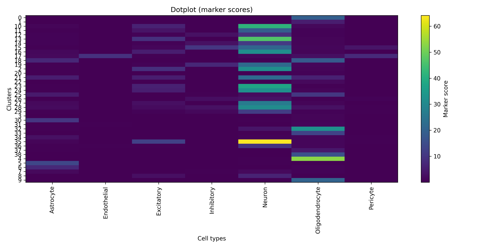

# Résultats

## TL;DR

- scVI réussit une intégration multi-cohorte cohérente (batch mixing globalement bon)
- clusters biologiquement interprétables avec structure continue
- signatures ALS significativement enrichies dans neurones et astrocytes
- validation littérature significative (z-score élevé, p-value empirique faible)
## Métriques de l'annotation des clusters/cellules :

| Cluster | KNN purity | Patient mixing | Silhouette | AUC separation |
|---------|------------|----------------|-------------|-----------------|
| 0  | 0.9999812 | 0.5298145472910281 | 0.10543973 | 0.5916693092796823 |
| 1  | 0.9844248 | 0.521487596063689 | 0.034940958 | 0.0034920301094490958 |
| 2  | 0.9891347 | 0.49445455579570013 | 0.04358642 | 0.22472557160732565 |
| 3  | 0.8020618 | 0.43717148924873905 | 0.16762199 | 0.1764169100079639 |
| 4  | 0.9999878 | 0.4700592235139285 | 0.14220202 | 0.8976627428042211 |
| 5  | 0.9899557 | 0.41178039452495974 | 0.16957031 | 0.23216082930756832 |
| 6  | 0.948381 | 0.4228526843967338 | 0.05632982 | 0.32444812139311513 |
| 7  | 0.55159646 | 0.6017629179331307 | 0.24364752 | 0.17783326096396002 |
| 8  | 0.92674404 | 0.4724888867491534 | 0.12217827 | 0.03533773048962496 |
| 9  | 0.9999612 | 0.5198953386956101 | 0.004589626 | 0.6489404658074105 |
| 10 | 0.99469155 | 0.5561152164077816 | 0.06916727 | 0.3198612577288493 |
| 11 | 0.9829955 | 0.5124499907267572 | 0.11961709 | 0.24789364915348544 |
| 12 | 0.94367343 | 0.6850111092121005 | 0.059464067 | 0.04988463510511021 |
| 13 | 0.9896458 | 0.5548039678790742 | 0.11046562 | 0.22494095418044402 |
| 14 | 0.9713554 | 0.6878297240774472 | 0.18714653 | 0.011738514470754913 |
| 15 | 0.949202 | 0.6437130994553003 | 0.10891711 | 0.12872814535481658 |
| 16 | 0.9858981 | 0.5987602665426933 | 0.100313924 | 0.3397257089725708 |
| 17 | 0.82313097 | 0.603621006857334 | 0.058339335 | 0.23018063221274465 |
| 18 | 0.87018305 | 0.48846101694915256 | 0.03274032 | 0.36126553672316375 |
| 19 | 0.9839354 | 0.6133615167819626 | 0.2808659 | 0.010905073020753275 |
| 20 | 0.6684354 | 0.4158246307272556 | 0.23189943 | 0.17301721704769973 |
| 21 | 0.85055983 | 0.6191884951206985 | 0.05656174 | 0.34260400616332815 |
| 22 | 0.93344194 | 0.5272747014115092 | 0.43014935 | 0.3043973941368079 |
| 23 | 0.9955235 | 0.5767990373044525 | 0.24413314 | 0.24467509025270762 |
| 24 | 0.99660283 | 0.5753282737019636 | 0.25575256 | 0.23509215757137691 |
| 25 | 0.8459624 | 0.6455381134210154 | -0.0075063165 | 0.09857163060387492 |
| 26 | 0.7936715 | 0.44476500697999066 | 0.10962577 | 0.15844578873894843 |
| 27 | 0.9905133 | 0.621832358674464 | 0.37589124 | 0.5012183235867447 |
| 28 | 0.944898 | 0.4581254724111867 | 0.05955302 | 0.5410997732426304 |
| 29 | 0.9811578 | 0.6133181990162694 | 0.40367448 | 0.20332009080590235 |
| 30 | 0.9141892 | 0.5608671171171171 | 0.19382991 | 0.5132319819819819 |
| 31 | 0.86330724 | 0.32803284807764094 | 0.39451948 | 0.35610302351623746 |
| 32 | 0.8765499 | 0.6434860736747529 | 0.25066102 | 0.4773135669362084 |
| 33 | 0.96028364 | 0.4815602836879433 | 0.20630193 | 0.5379939209726443 |
| 34 | 0.835775 | 0.44161358811040335 | 0.3277884 | 0.2022292993630574 |
| 35 | 0.9972056 | 0.6513639387890885 | 0.4060737 | 0.2719560878243513 |
| 36 | 0.9184629 | 0.4070175438596491 | 0.23307657 | 0.3571428571428572 |
| 37 | 0.9897763 | 0.3691160809371672 | 0.2955707 | 0.057507987220447254 |
| 38 | 0.9984762 | 0.5169523809523809 | — | 0.020000000000000018 |

Ces métriques semblent indiquer que, malgré le fait que certains clusters soient probablement des artefacts, de l'information biologique est présente dans cet espace.  
Les cellules sont regroupées par type et mélangées entre patients. Les clusters semblent plutôt former un continuum au vu des scores de silhouette. Les annotations paraissent relativement robustes au regard des valeurs d’AUC separation.

**Dotplot markers**

## Résultats des pathways GSEA par type cellulaire :

Voici un résumé réalisé avec un LLM sur les différents pathways obtenus avec GSEA. N'étant pas biologiste, ces résultats sont donc à interpréter avec une très grande prudence. 
On ne conserve que les pathways avec un NES > 1.5, une FDR < .05 et un nombre minimum de gènes dans le pathway de 10.
La liste de tous les pathways est disponible dans `sources/TOP_PATHWAYS.csv`.

Astrocytes

Les astrocytes montrent une signature dominante région_FX marquée par une forte activation du métabolisme mitochondrial (OXPHOS, import mitochondrial) et des voies de sensing des nutriments (mTORC1, Myc, starvation response), indiquant une reprogrammation énergétique intrinsèque. Les processus de localisation protéique et de réorganisation intracellulaire confirment cet axe métabolique et structural. En parallèle, les voies synaptiques sont fortement enrichies mais principalement classées en interaction_SC / interaction_FX, suggérant un rôle de modulation glie–neurone plutôt qu’une activité neuronale propre. Les signaux de stress protéique sont présents mais globalement contextuels, tandis que les voies immuno-inflammatoires en global_condition apparaissent plutôt réprimées.

Endothelial

Profil global dominé par une forte reprogrammation énergétique avec activation des voies mitochondriales (OXPHOS, respiration, glycolyse) et du sensing des nutriments (mTORC1, starvation), indiquant un état métabolique très dynamique dépendant de l’énergie disponible.

On observe en parallèle une signature neuro-like marquée (synapses, neurotransmission, GABA/glutamate, canaux ioniques), suggérant une forte plasticité de signalisation plutôt qu’un programme purement vasculaire classique.

Les modules de stress (hypoxie, UV, TNF/NF-κB, IFNγ) montrent un état cellulaire activé et sensible à l’environnement inflammatoire et hypoxique, avec adaptation métabolique associée.

Enfin, les directions régionales FX/SC/MCX indiquent une séparation nette entre un programme métabolique (FX), un module signalisation/immunité (SC), et une composante de remodelage/interaction synaptique et transport (MCX), avec quelques signatures globalement répressives sur certains axes inflammatoires et synaptiques.

Excitatory

Le profil est dominé par une très forte activation des programmes de stress protéique et chaperonnes (HSF1, HSP70/HSP90, heat shock), indiquant une charge protéotoxique élevée et une réponse adaptative majeure au stress cellulaire.

On observe également une activation nette de modules inflammatoires et immuno-like (neutrophil degranulation, ROS/transport vésiculaire), suggérant un état excitatoire associé à des processus de stress et de signalisation extracellulaire intense.

Les voies de signalisation hormonale et de croissance (récepteurs stéroïdiens, estrogen-dependent expression, mTORC1, MYC) indiquent une forte reprogrammation transcriptionnelle couplée à des axes métaboliques et de prolifération.

Enfin, le métabolisme énergétique mitochondrial est très présent mais contrasté selon les modules (OXPHOS à la fois activé et réorganisé selon les régions FX/MCX), ce qui suggère une adaptation énergétique plutôt qu’un simple gain ou perte d’activité.

Inhibitory

Signature fortement enrichie en métabolisme énergétique (OXPHOS, TCA, glycolyse) avec une cohérence élevée entre régions MCX et FX.
Présence dominante de processus de transport d’électrons mitochondrial et de régulation du fer, suggérant un état énergétique stable mais contraint.
Enrichissement important des voies de signalisation immunitaire et apoptotique, indiquant un couplage métabolisme–stress cellulaire.
Les interactions synaptiques et GABAergiques restent présentes mais secondaires, compatibles avec un rôle régulateur plus que excitateur.

Neurons

Les résultats montrent une forte activation du métabolisme mitochondrial et des programmes Myc/mTORC1 dans plusieurs régions, notamment MCX, FX et Neuron global, avec enrichissement de l’oxydative phosphorylation et du transport mitochondrial. En parallèle, on observe une activation des réponses au stress (HSF1, HSP, UPR) dans ces mêmes régions, suggérant une forte demande cellulaire. À l’inverse, les voies de transmission synaptique (récepteurs, canaux ioniques, NMDA, GABA) sont globalement inhibées, surtout en SC et MCX. Globalement, le profil évoque une bascule vers un état métabolique actif mais une réduction de la signalisation neuronale fonctionnelle.

Oligodendrocytes

On observe une forte activation des programmes mitochondriaux, notamment Oxidative Phosphorylation (régions FX, SC et MCX), suggérant une demande énergétique élevée.
Les signatures de signalisation synaptique / neuronal system sont aussi très représentées, surtout en régions FX et MCX, avec des gènes liés aux neurotransmetteurs (GABA, glutamate, synapse).
Des voies de stress cellulaire et réponse aux protéines chaperonnes (heat shock, HSP90/HSPA) sont enrichies dans plusieurs régions (FX, MCX, interaction FX).
On note également des signaux immuno-viraux (SARS-CoV, TCR, allograft rejection) et de signalisation intracellulaire (DARPP-32, G alpha, NF-kB) principalement en régions FX et MCX.
Globalement, les enrichissements suggèrent un état oligodendrocytaire actif, métaboliquement élevé et fortement couplé à des interactions neuronales et au stress cellulaire.

Pericytes

On observe une forte activation du métabolisme énergétique avec Oxidative Phosphorylation en régions FX et MCX, indiquant une activité mitochondriale élevée.
Les voies de signalisation vasculaire et métabolique sont très représentées, notamment insulin receptor signaling, PPARα / lipid metabolism et glycolyse, surtout en région FX.
Un ensemble important de signatures synaptiques et neuronales (NMDA, glutamate, synapses, plasticité) apparaît en région MCX, suggérant une forte interaction neuro-vasculaire.
On retrouve également des modules de stress cellulaire, hypoxie et ROS, ainsi que des programmes de réponse inflammatoire et immunitaire (IFN-γ, inflammation, apoptose), répartis entre FX, MCX et SC.
Globalement, le profil indique un état de péricyte très actif, couplant métabolisme énergétique, réponse au stress et communication avec le système neuronal et vasculaire.

## Validation sur la littérature existante :

| Celltype        | Observed score | Null mean        | Null std         | Z-score        | P-value (empirical) | N genes |
|----------------|---------------|------------------|------------------|----------------|----------------------|---------|
| Inhibitory      | 0.1276088617  | 0.0132262707     | 0.0075975351     | 15.0552238005  | 0.000999000999       | 66      |
| Pericyte        | 0.0098039216  | 0.0142770747     | 0.0128665725     | -0.3476569324  | 0.5854145854         | 35      |
| Endothelial     | 0.0369230769  | 0.0123084996     | 0.0084110010     | 2.9264742008   | 0.007992007992       | 62      |
| Neuron          | 0.1799999858  | 0.0111935882     | 0.0054035554     | 31.2398755246  | 0.000999000999       | 130     |
| Oligodendrocyte | 0.1108630952  | 0.0132356587     | 0.0078101026     | 12.5001477007  | 0.000999000999       | 73      |
| Astrocyte       | 0.2563003663  | 0.0146984123     | 0.0096758222     | 24.9696561750  | 0.000999000999       | 54      |

Les résultats montrent un enrichissement fortement significatif des pathways associés aux signatures ALS dans plusieurs celltypes, en particulier les neurones et les astrocytes, avec des z-scores élevés et des p-values empiriques très faibles, tandis que les pericytes ne présentent pas d'enrichissement détectable.
